# From my dedicated PoC collections doc

## Purpose 

The [Exercise PoC](Exercise-PoC.md) displays a verbose level of analysis based on the initial execution of PoC Exercise. The following is an unabridged version of this execution, allowing greater visibility into process and scope. For context on this execution, see [Appendix B: Research](Appendix-b-research.md).

## Document Directory

[Repository README](README.md) | [Infrastructure Baseline](Infrastructure-Baseline.md) | [Exercise PoC](Exercise-PoC.md) | [Appendix A: Collections](Appendix-a-collections.md) | [Appendix B: Research](Appendix-b-research.md)

### 0.) Create a test user account on the Windows host to SSH into, exposing SSH and RDP

[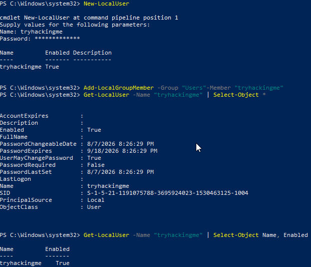](assets/poc/appendix-a-collections/appendix-a-screenshot-01.png)

[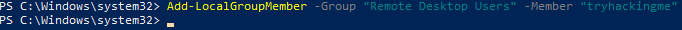](assets/poc/appendix-a-collections/appendix-a-screenshot-02.png)

- Note: SSH was already exposed via localadmin configuration

- Starting point in Wazuh

### 1.) Fail SSH login 9 times using code from step 2 (below) with wrong username to trigger remote access failure, sshd brute-force attack detected, and failed login alerts

[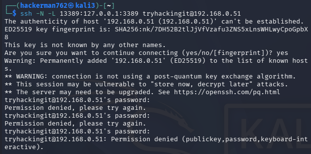](assets/poc/appendix-a-collections/appendix-a-screenshot-04.png)

[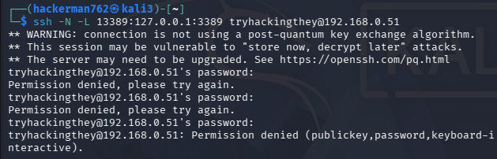](assets/poc/appendix-a-collections/appendix-a-screenshot-05.png)

- 7 other attempted logins within 2 minutes total existed after these (not documented)

[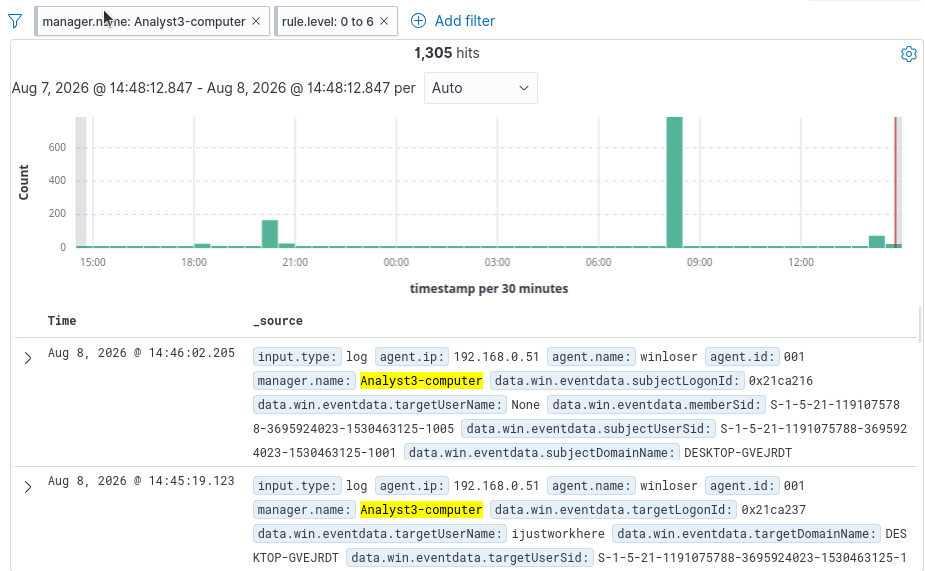](assets/poc/appendix-a-collections/appendix-a-screenshot-06.png)

- Checking for low level alerts that are new

  - Validating

[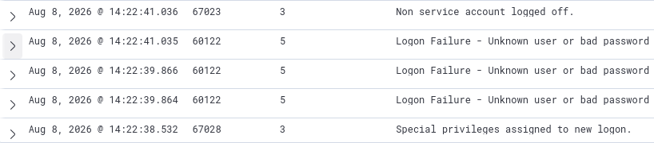](assets/poc/appendix-a-collections/appendix-a-screenshot-07.png)

- Sample from query “rule.level: 0 to 6” directly after failed logons

[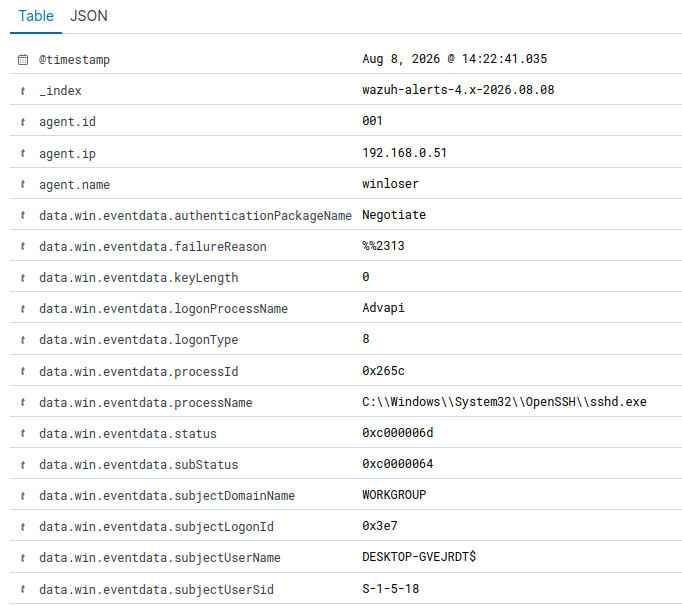](assets/poc/appendix-a-collections/appendix-a-screenshot-08.png)

- Full log entry for every one looks like this

[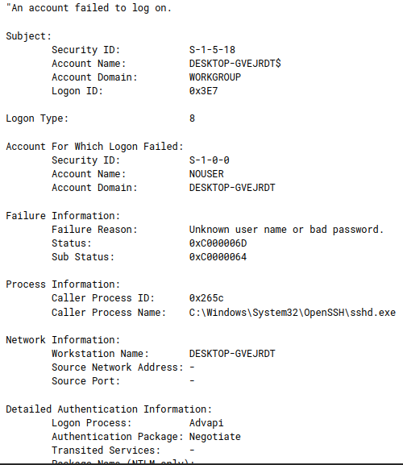](assets/poc/appendix-a-collections/appendix-a-screenshot-09.png)

- What Wazuh took from windows

Desired rule id firings included:

- 64101

- 64109

- 5720

- 5712

### 2.) succeed in SSH login with the SSH -N -L 13389:127.0.0.1:3389 \<localuser\>@192.168.0.51

[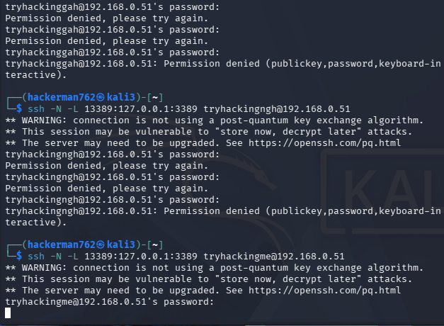](assets/poc/appendix-a-collections/appendix-a-screenshot-10.png)

- The process being continuous is purposeful, this means listening has been established and a shell has not (-L and -N respectively).

[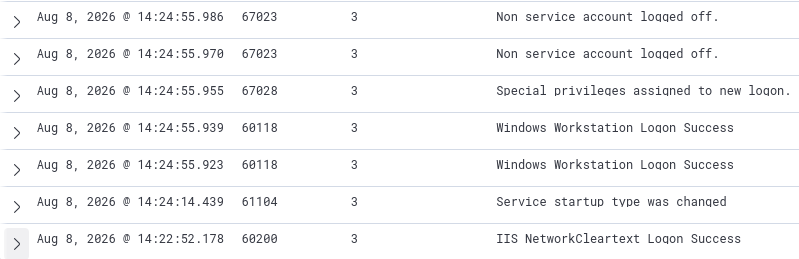](assets/poc/appendix-a-collections/appendix-a-screenshot-11.png)

- Sample from logs

[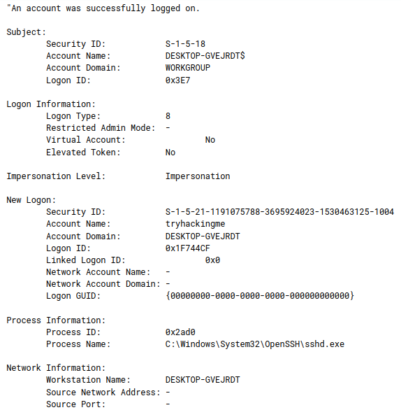](assets/poc/appendix-a-collections/appendix-a-screenshot-12.png)

- Successful logon looks like this

  - Note: Process Name being sshd.exe should be quite suspicious

Desired rule firings included:

- 5715

- 64102

### 3.) Using RDP, route Kali through port 13389, displaying RDP from loopback on windows, triggering the level 15 alert for RDP through loopback

[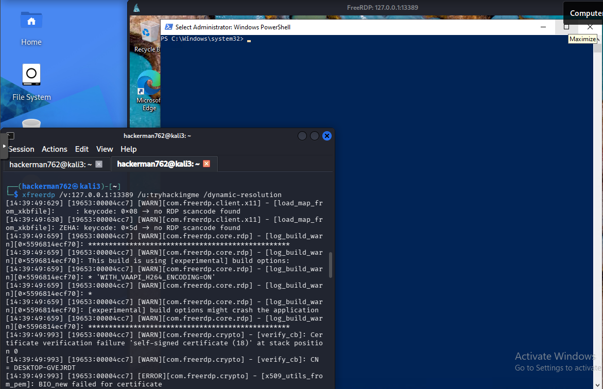](assets/poc/appendix-a-collections/appendix-a-screenshot-13.png)

- Logged in + rdp command

  - Note: There was an admin powershell already open. I closed it because I didn’t want to spoil the next rule firing, this was a oversight from prior activity in setting up the environment.

[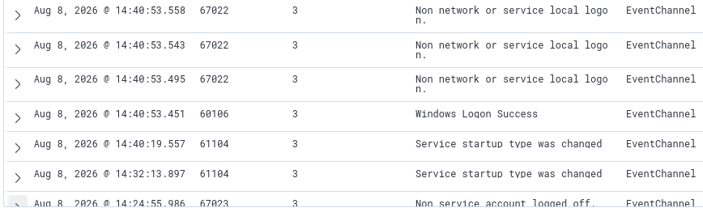](assets/poc/appendix-a-collections/appendix-a-screenshot-14.png)

- A windows logon success, when correlated to the timeline, can become crucial to an investigation.

[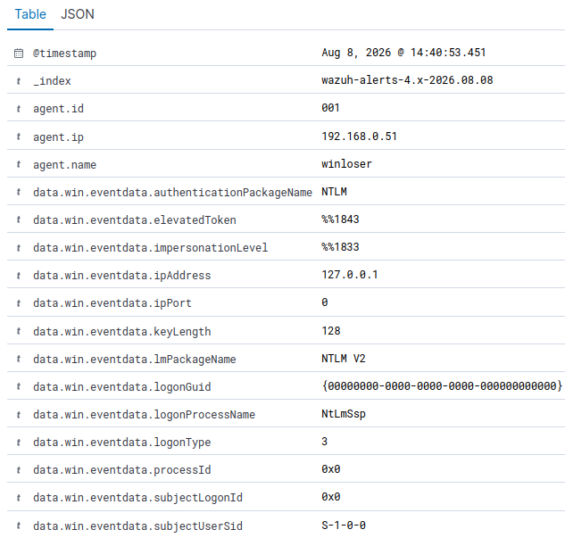](assets/poc/appendix-a-collections/appendix-a-screenshot-15.png)

- Sample log from windows logon success

[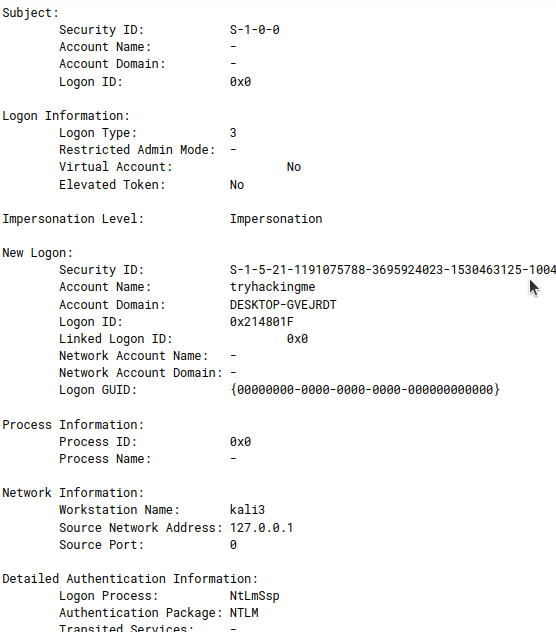](assets/poc/appendix-a-collections/appendix-a-screenshot-17.png)

- Very odd logon.

  - Event type 3 occurs when there’s shared resources over the network, in this case the “shared resource” was the authentication that rdp validates prior to connection

  - Cross-referencing the account name and workstation name, we see very quickly how suspicious that is (given that “kali3” is not a known admin)

[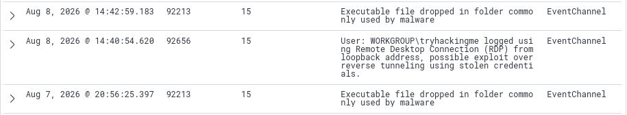](assets/poc/appendix-a-collections/appendix-a-screenshot-18.png)

- Sample from the critical errors (15’s). 92656 is what we’re looking for.

[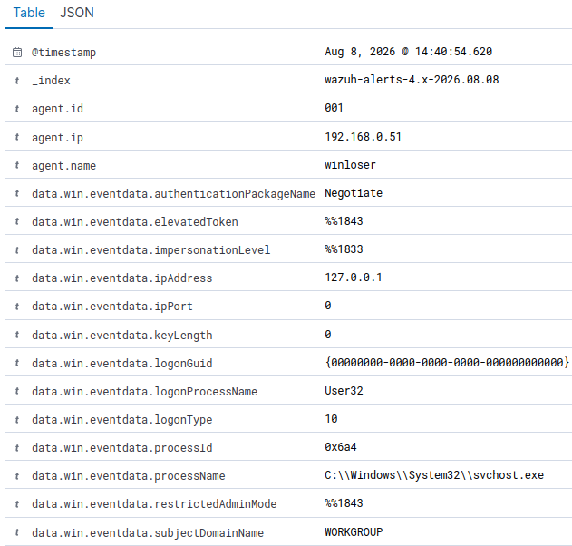](assets/poc/appendix-a-collections/appendix-a-screenshot-19.png)

- There’s some interesting fields even at first glance

  - data.win.eventdata.ipAddress doesn’t make sense for the logonProcessName being 32 (which basically means the system is making a logon happen).

[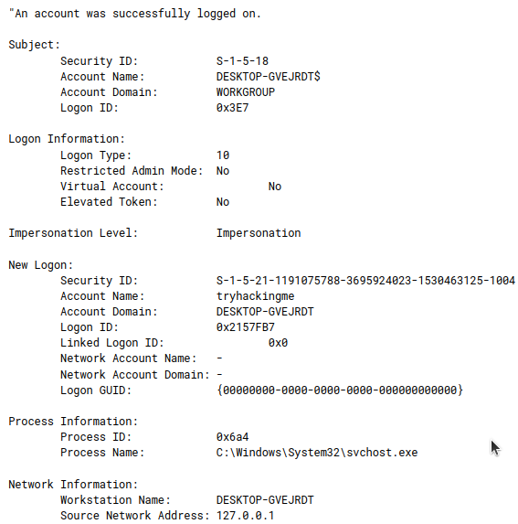](assets/poc/appendix-a-collections/appendix-a-screenshot-20.png)

- The windows side of things looks odd too. Logged on from 127.0.0.1 by svchost, but if you correlate to the logs from the lower end, the same time range shows another host being logged out.

[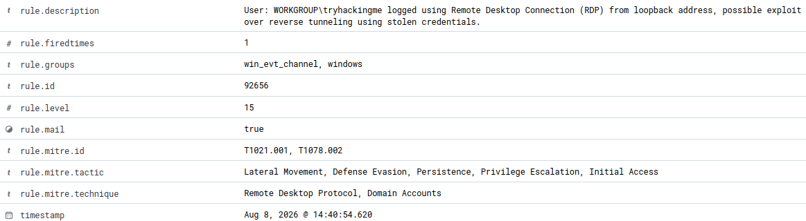](assets/poc/appendix-a-collections/appendix-a-screenshot-21.png)

- Timestamp here is 14:40:54.620

  - Directly after the new login by kali3

- More useful information if you’re putting a report together

### 4.) Attempt (unsuccessfully) to create a symbolic link using command New-Item -ItemType SymbolicLink -Path "\$env:USERPROFILE\Desktop\lab-link.txt" -Target "\$env:WINDIR\System32\drivers\etc\hosts" to trigger failed privileged operation

[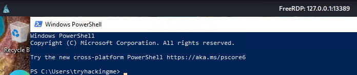](assets/poc/appendix-a-collections/appendix-a-screenshot-22.png)

[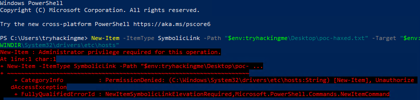](assets/poc/appendix-a-collections/appendix-a-screenshot-23.png)

Desired Rule Firing included:

- 60107

  - Note: I couldn’t find this. I’m not well-versed in red teaming, so I’d like to point the blame there first– but I think this might be something to look into later, i.e. the screenshot shows that it registered as an administrative process attempt but the alert never fired.

    - This deep dive is outside the scope of this PoC, I’ll cut my losses for now.

### 5.) Use an administrator powershell instance (I'll be pretending the attacker also has the admin's login at this point, there's a lot of ways they could have done that at this stage so I'll gloss over that), which may not trigger an alert but is essential for steps 6 and 7

[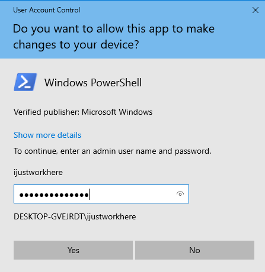](assets/poc/appendix-a-collections/appendix-a-screenshot-24.png)

- First time we’re seeing the admin’s name, “ijustworkhere”

### 6.) Create a user account for attacker persistence, triggering user account enabled or created

[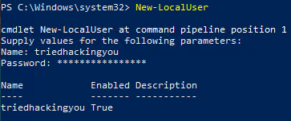](assets/poc/appendix-a-collections/appendix-a-screenshot-25.png)

- Adversary perspective

[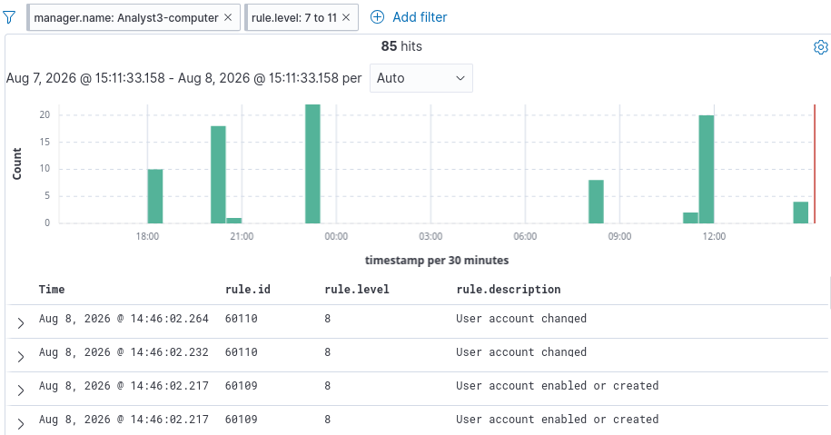](assets/poc/appendix-a-collections/appendix-a-screenshot-26.png)

- Alerts fired from the new account creation

[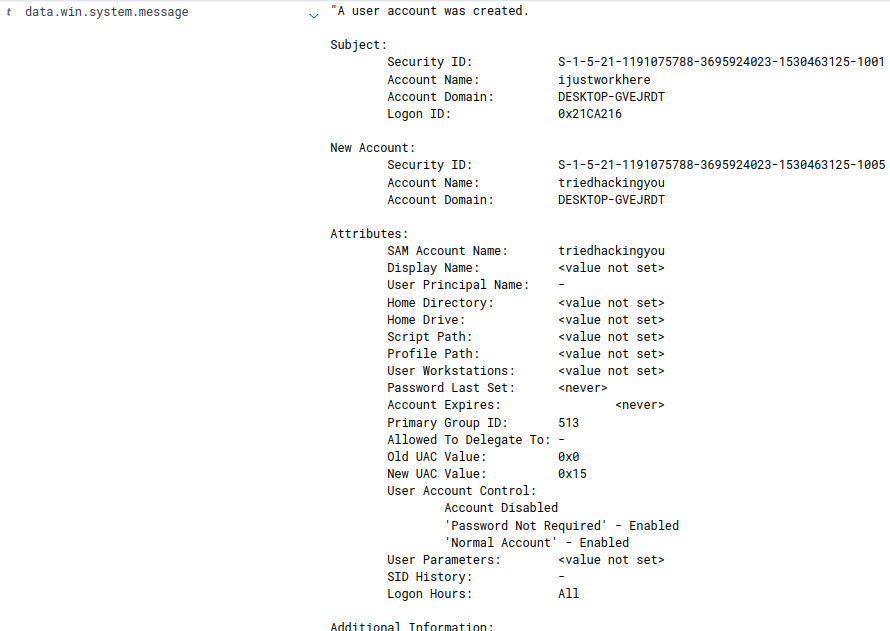](assets/poc/appendix-a-collections/appendix-a-screenshot-27.png)

- First log on new account creation

[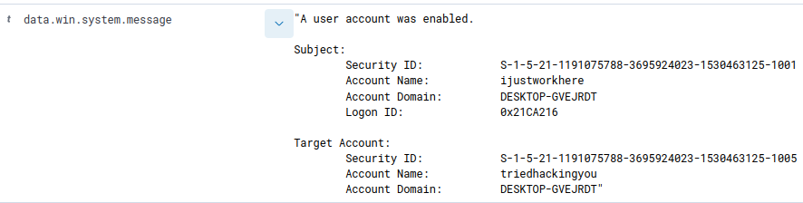](assets/poc/appendix-a-collections/appendix-a-screenshot-28.png)

- Second log, note: it’s at the exact same time so it’s the exact same action being logged, but this one is less verbose.

- 60109

### 7.) Elevate that user account's privileges using Add-LocalGroupMember -Group "Administrators" -Member "\<username\>" command, triggering Administrators Group Changed.

[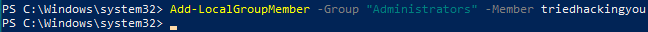](assets/poc/appendix-a-collections/appendix-a-screenshot-29.png)

- Adversary perspective

  - Note the C:\Windows\system32, even without the prior login screenshot, it’s obvious this is an admin instance.

- Note that even during the length of this exercise, there was some noise. The DLL created is an RDP printer driver update spool, nothing to do with the activities of our “hacker” in this instance.

- The log itself looks like this, where AUDIT_SUCCESS and the timestamp under it are incredibly important

Desired rule firing included:

- 60154

[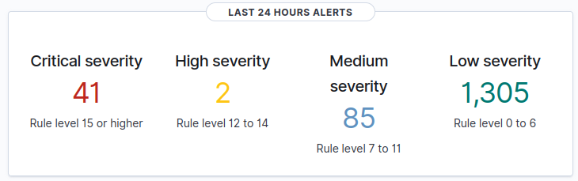](assets/poc/appendix-a-collections/appendix-a-screenshot-33.png)

Dashboard before and after “hacked”

*end of collections*
