# From my dedicated “PoC rule research” doc

## The purpose in containing the background research of this PoC exercise is to show the level of research and kinds of findings it takes to put together a well-informed project aimed at education. Too few learners put documentation of their process out in the open. The research shown below hopes to provide context for my process as a project planner and help other learners to better their planning processes–specifically as it pertains to research, narrowing scope, and pragmatic approaches to educational project design.

Note that, in opposition to the prior collections sequence, these notes are more of a chronological log or observational diary. The learning process rarely happens cleanly, although I have cleaned this document enough to understand by an outside observer.

## Document Directory

[Repository README](README.md) | [Infrastructure Baseline](Infrastructure-Baseline.md) | [Exercise PoC](Exercise-PoC.md) | [Appendix A: Collections](Appendix-a-collections.md) | [Appendix B: Research](Appendix-b-research.md)

### Major headings

- [The purpose in containing the background research of this PoC exercise is to show the level of research and kinds of findings it takes to put together a well-informed project aimed at education. Too few learners put documentation of their process out in the open. The research shown below hopes to provide context for my process as a project planner and help other learners to better their planning processes–specifically as it pertains to research, narrowing scope, and pragmatic approaches to educational project design.](#major-section-01)

### Screenshots

- [appendix-b-screenshot-01.png](#screenshot-appendix-b-01)
- [appendix-b-screenshot-02.png](#screenshot-appendix-b-02)
- [appendix-b-screenshot-03.png](#screenshot-appendix-b-03)
- [appendix-b-screenshot-04.png](#screenshot-appendix-b-04)
- [appendix-b-screenshot-05.png](#screenshot-appendix-b-05)
- [appendix-b-screenshot-06.png](#screenshot-appendix-b-06)
- [appendix-b-screenshot-07.png](#screenshot-appendix-b-07)
- [appendix-b-screenshot-08.png](#screenshot-appendix-b-08)
- [appendix-b-screenshot-09.png](#screenshot-appendix-b-09)
- [appendix-b-screenshot-10.png](#screenshot-appendix-b-10)
- [appendix-b-screenshot-11.png](#screenshot-appendix-b-11)
- [appendix-b-screenshot-12.png](#screenshot-appendix-b-12)
- [appendix-b-screenshot-13.png](#screenshot-appendix-b-13)
- [appendix-b-screenshot-14.png](#screenshot-appendix-b-14)
- [appendix-b-screenshot-15.png](#screenshot-appendix-b-15)
- [appendix-b-screenshot-16.png](#screenshot-appendix-b-16)
- [appendix-b-screenshot-17.png](#screenshot-appendix-b-17)
- [appendix-b-screenshot-18.png](#screenshot-appendix-b-18)
- [appendix-b-screenshot-19.png](#screenshot-appendix-b-19)
- [appendix-b-screenshot-20.png](#screenshot-appendix-b-20)
- [appendix-b-screenshot-21.png](#screenshot-appendix-b-21)
- [appendix-b-screenshot-22.png](#screenshot-appendix-b-22)
- [appendix-b-screenshot-23.png](#screenshot-appendix-b-23)
- [appendix-b-screenshot-24.png](#screenshot-appendix-b-24)
- [appendix-b-screenshot-25.png](#screenshot-appendix-b-25)
- [appendix-b-screenshot-26.png](#screenshot-appendix-b-26)
- [appendix-b-screenshot-27.png](#screenshot-appendix-b-27)
- [appendix-b-screenshot-28.png](#screenshot-appendix-b-28)
- [appendix-b-screenshot-29.png](#screenshot-appendix-b-29)
- [appendix-b-screenshot-30.png](#screenshot-appendix-b-30)
- [appendix-b-screenshot-31.png](#screenshot-appendix-b-31)
- [appendix-b-screenshot-32.png](#screenshot-appendix-b-32)
- [appendix-b-screenshot-33.png](#screenshot-appendix-b-33)
- [appendix-b-screenshot-34.png](#screenshot-appendix-b-34)
- [appendix-b-screenshot-35.png](#screenshot-appendix-b-35)
- [appendix-b-screenshot-36.png](#screenshot-appendix-b-36)
- [appendix-b-screenshot-37.png](#screenshot-appendix-b-37)
- [appendix-b-screenshot-38.png](#screenshot-appendix-b-38)
- [appendix-b-screenshot-39.png](#screenshot-appendix-b-39)
- [appendix-b-screenshot-40.png](#screenshot-appendix-b-40)
- [appendix-b-screenshot-41.png](#screenshot-appendix-b-41)
- [appendix-b-screenshot-42.png](#screenshot-appendix-b-42)

### My scope looks something like this:

[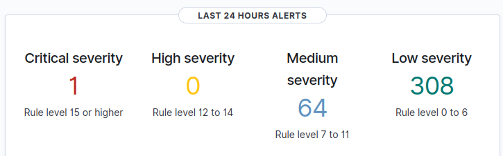](assets/poc/appendix-b-research/appendix-b-screenshot-01.png)

- I’d like to find a 0-6 rule, a 7-11, a 12-14, and a 15+

  - That’s the basis of this whole project, so I can’t forget this as I deep dive…

[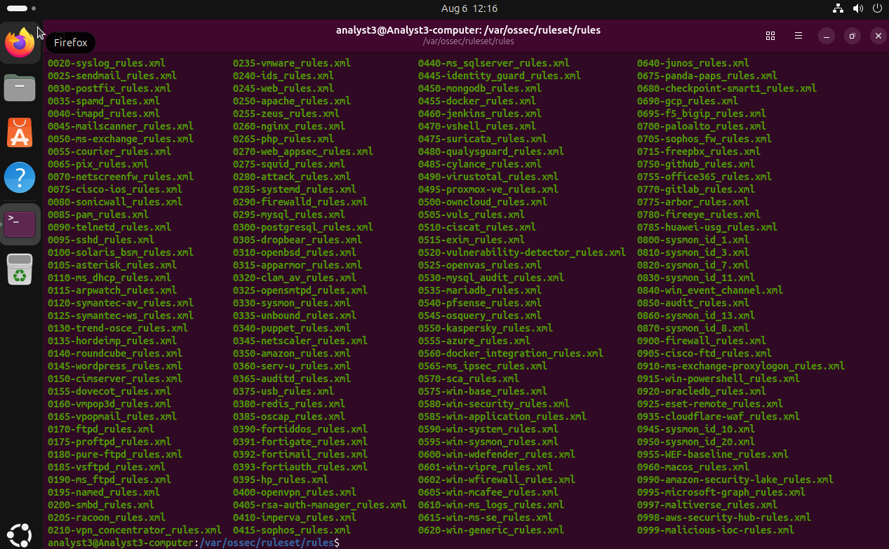](assets/poc/appendix-b-research/appendix-b-screenshot-02.png)

- Inside the Wazuh rules folder, rule list complete

### The rulesets that interest me are as follows:

1.  0330-sysmon_rules.xml

2.  0575-win-base_rules.xml

3.  0580-win-security_rules.xml

4.  0590-win-system_rules.xml

5.  0595-win-sysmon_rules.xml

6.  0600-win-wdefender_rules.xml

7.  0602-win-wfirewall_rules.xml

8.  0620-win-generic_rules.xml

9.  0800/0810/0820/0830/0860/0870/0945/0950 — Sysmon Event IDs 1/3/7/11/13/8/10/22

10. 0840-win_event_channel.xml

11. 0915-win-powershell_rules.xml

12. 0999-malicious-ioc-rules.xml

### This is where the deep dive begins. The following logs the discovery and exploration of these rulesets as needed to define my PoC exercise.

1.  0330-sysmon_rules.xml

[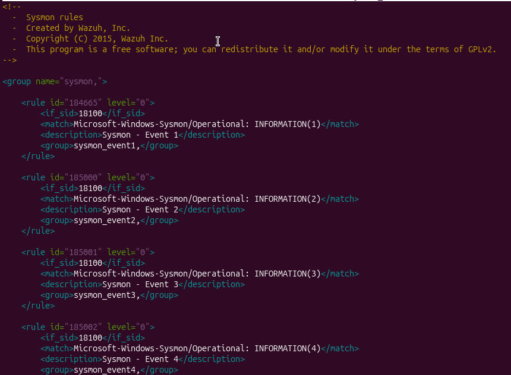](assets/poc/appendix-b-research/appendix-b-screenshot-03.png)

- Opening page

[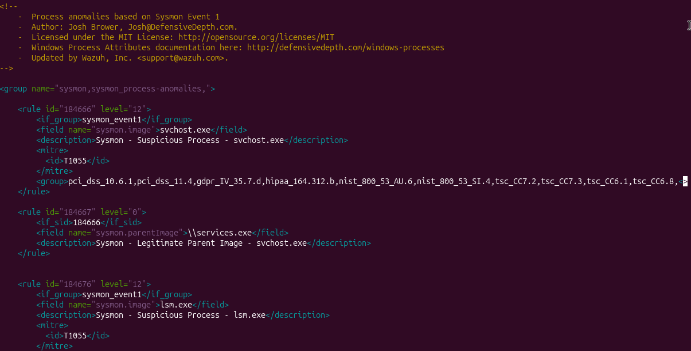](assets/poc/appendix-b-research/appendix-b-screenshot-04.png)

- Where things got interesting (and useful)

- All sysmon rules here are configured based on sysmon 1. This looks, if anything, like a config for how the system should be organizing sysmon generally. Almost like telling the system to hold certain information that could be useful background for an investigation, rather than alerting that would go into an EDR or something. I’ll use a different ruleset for my projects…

2.  0575-win-base_rules.xml

[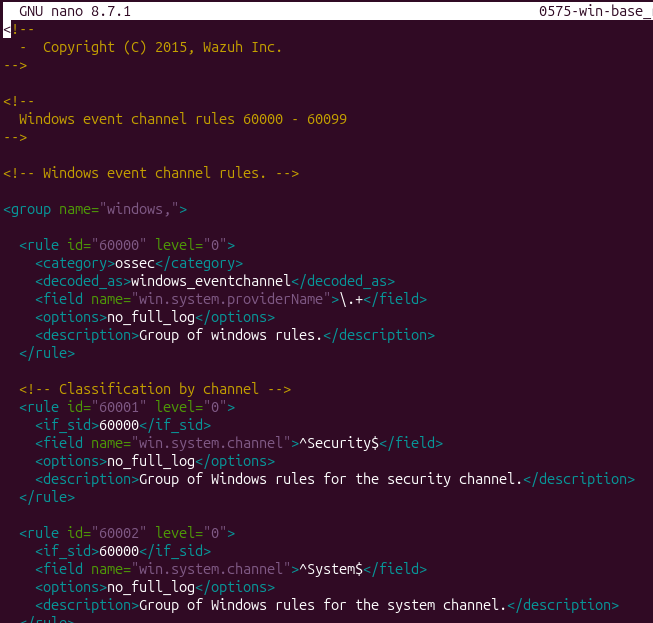](assets/poc/appendix-b-research/appendix-b-screenshot-05.png)

- Inside the windows base ruleset

[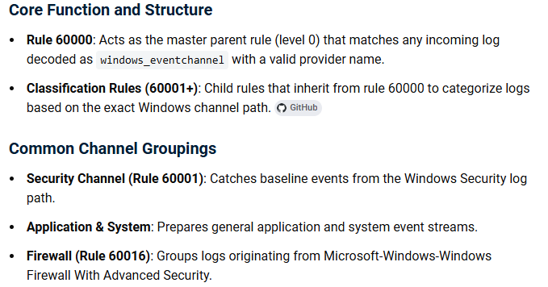](assets/poc/appendix-b-research/appendix-b-screenshot-06.png)

- Context excerpt from Gemini

  - Basically, this is another config of sorts. It tells wazuh that it has to pay attention to winevent.

3.  0580-win-security_rules.xml

[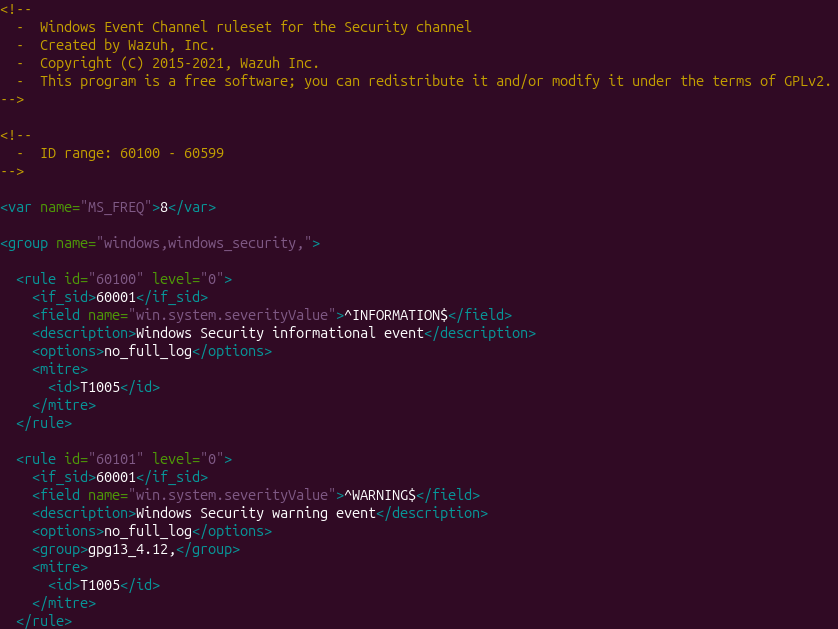](assets/poc/appendix-b-research/appendix-b-screenshot-07.png)

- Front page of the security rules

- I think it’s another config to organize logs for Wazuh

[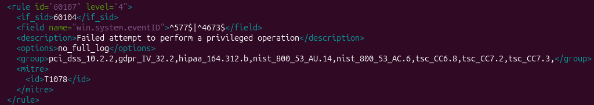](assets/poc/appendix-b-research/appendix-b-screenshot-08.png)

- This exact log is what I’m worried about

  - This should be higher in my environment since a lot of my exercises will rely on authentication attempts.

    - Note: One of my ideas is to create a mock password list including 100 variations on the password (scenario = “I saw them type it in on the cctv but I didn’t have the exact digits, it’s probably one of these”), then do 99 failed attempts and 1 success over like 2 hours. Maybe one every 60-90 seconds, which I know you can set in Hydra.

      - Note on note: I thought this was privileged logon failed, it’s privileged process. I’ll use an admin powershell.

  - **0-6 option**

[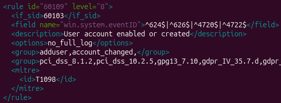](assets/poc/appendix-b-research/appendix-b-screenshot-09.png)

- **7-11 option**

[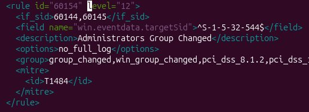](assets/poc/appendix-b-research/appendix-b-screenshot-10.png)

- **12-14 option**

4.  0590-win-system_rules.xml

5.  0595-win-sysmon_rules.xml

[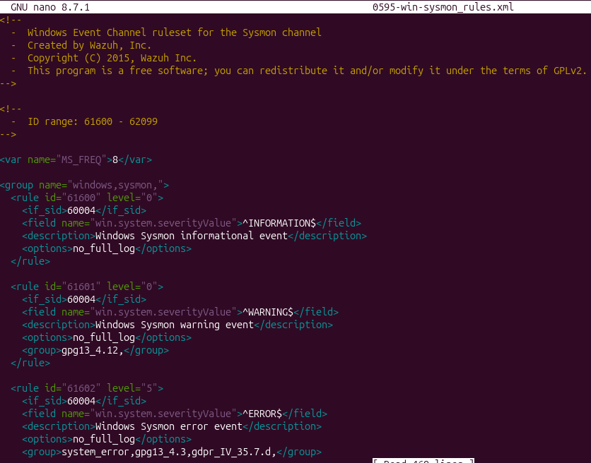](assets/poc/appendix-b-research/appendix-b-screenshot-11.png)

- Front page

[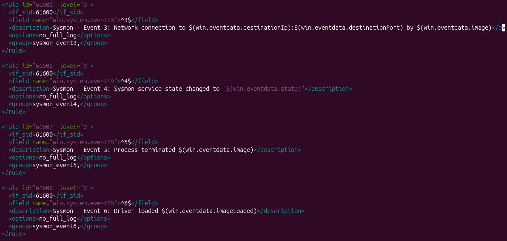](assets/poc/appendix-b-research/appendix-b-screenshot-12.png)

- I’m noticing a lot of level 0, I wonder what it’s doing… I’ll have to ask gpt.

  - Downstream is the keyword here. This rule just states that these sysmon ID’s should not be stored on their own, but that they should be accounted for (I think). In this case, I should be looking at more particular rules like “Event 3 involving PowerShell” to validate ruleset efficacy. They are collected as events, not alerts.

[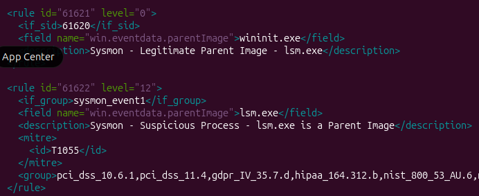](assets/poc/appendix-b-research/appendix-b-screenshot-13.png)

- Example of when there is an alert fired– lsm.exe is a parent image = suspicious.

[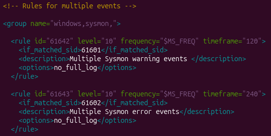](assets/poc/appendix-b-research/appendix-b-screenshot-14.png)

- A really good med-high alert

  - I just have to trigger multiple error or warning events within 4 or 2 minutes (respectively). I could use an automated pentesting/red teaming tool to activate every 2-5 seconds for a minute or two then check back.

  - **7-11 option**

6.  0600-win-wdefender_rules.xml

[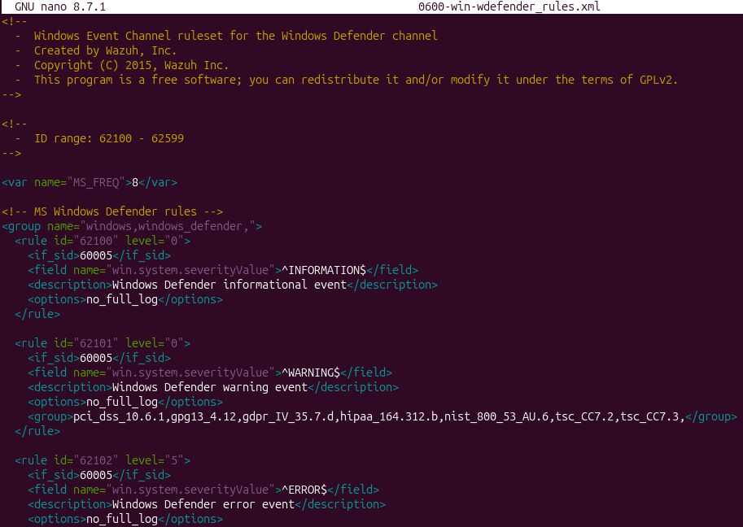](assets/poc/appendix-b-research/appendix-b-screenshot-15.png)

- Front page

[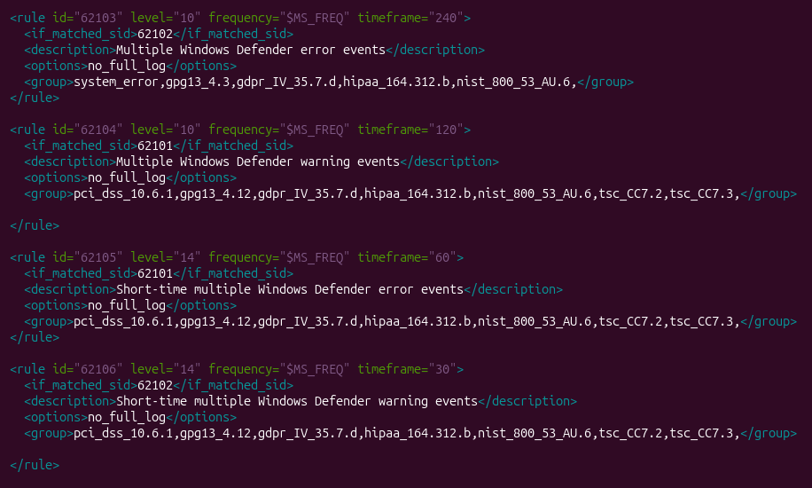](assets/poc/appendix-b-research/appendix-b-screenshot-16.png)

- Some 10 and 14 frequency based rules

- I looked into many of the others… it’s all about vulnerability scanning and the EDR activities, which is expected but out of scope

  - And most of them would be difficult to set off since I’d have to understand not just how Wazuh defines it but how Windows Defender defines the actions.

7.  0602-win-wfirewall_rules.xml

[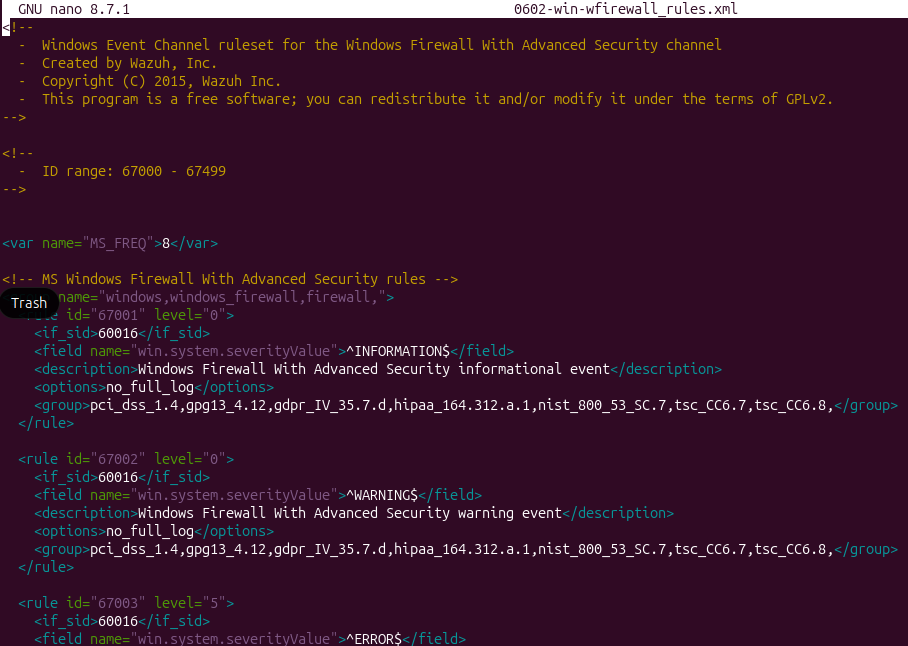](assets/poc/appendix-b-research/appendix-b-screenshot-17.png)

- Front page

[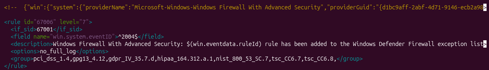](assets/poc/appendix-b-research/appendix-b-screenshot-18.png)

- Easy 7

  - All I have to do is make an exception to a rule. That would be a great way to manage C2 operations, just edit the firewall.

    - But how realistic is that? I think it’s realistic, but I’d like to validate.

  - This is what Gemini had to say about the scenario

[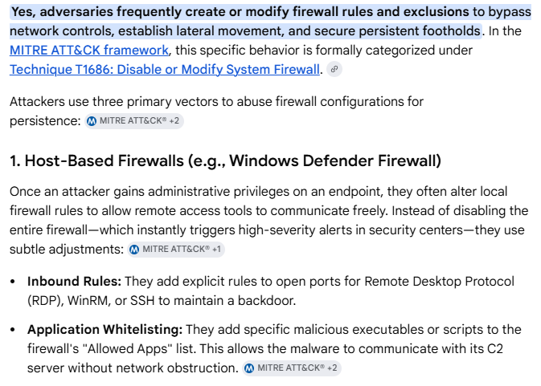](assets/poc/appendix-b-research/appendix-b-screenshot-19.png)

- **7-11 option**

8.  0620-win-generic_rules.xml

[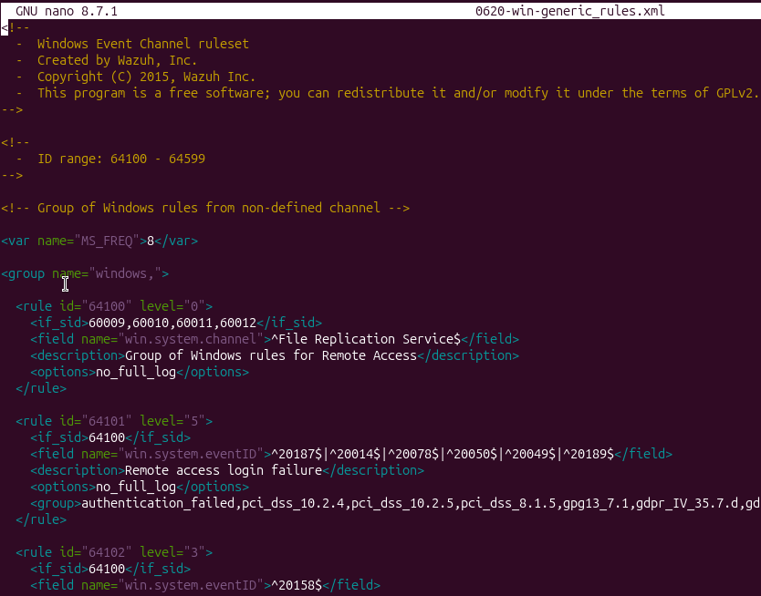](assets/poc/appendix-b-research/appendix-b-screenshot-20.png)

- Front page

[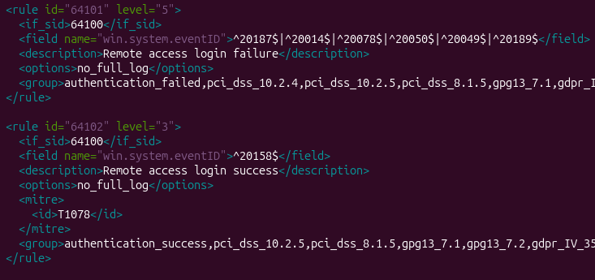](assets/poc/appendix-b-research/appendix-b-screenshot-21.png)

- These rules next to each other could infer a lot in an investigation

  - But the EDR should kick in by the time this really matters, “multiple” authentication failure. Unless I can do a timed script/tool, which I’d really like to do.

[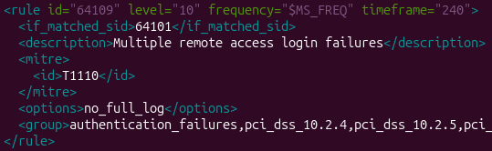](assets/poc/appendix-b-research/appendix-b-screenshot-22.png)

- It’s got me covered. This could be both a 0-6 and 7-11 option, a great way to demonstrate the rulesets.

9.  0800/0810/0820/0830/0860/0870/0945/0950 for sysmon 1 3 7 11 13 8 10 22

[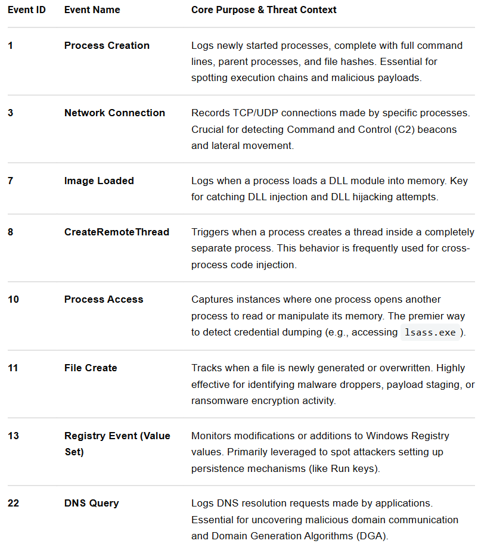](assets/poc/appendix-b-research/appendix-b-screenshot-23.png)

- First, Gemini’s quick list of these IDs for reference

- In many of my investigations, Sysmon 1 has the most important, but there are some that are more dangerous at face-value than others.

  - Danger zones look like: 7, 8, 10, 13

[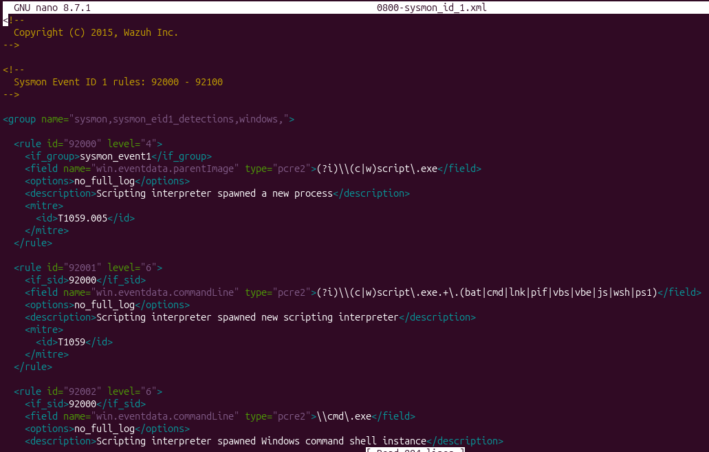](assets/poc/appendix-b-research/appendix-b-screenshot-24.png)

- Front page of sysmon 1

[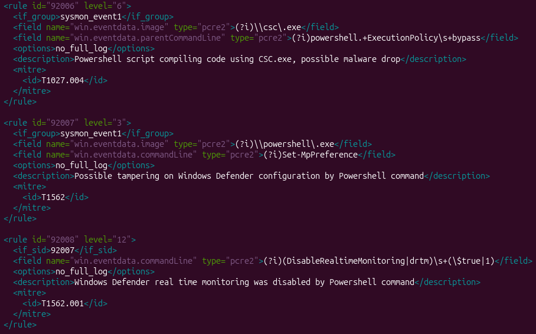](assets/poc/appendix-b-research/appendix-b-screenshot-25.png)

- A good ruleset sample. It seems like a lot of these are getting relatively low scores, I wonder why. I’ll ask gpt.

  - I was thinking these rules were used for individual analysis. Organizations don’t function like that, rather, they seem to each have a custom way of picking which incidents and alert clusters are investigated, where the alerts are used the same as events but with more info. Events (by SIEM logic) are stored for further information, where alerts are stored to give better visibility to the current standing of present potential threats.

[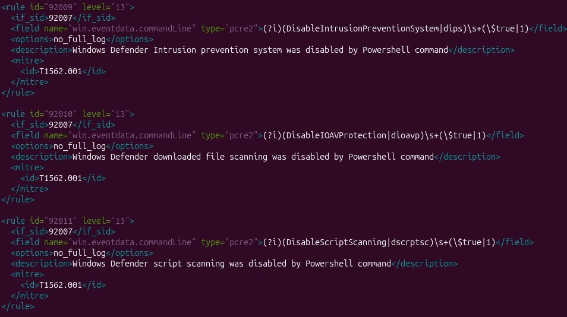](assets/poc/appendix-b-research/appendix-b-screenshot-26.png)

- Some good 13’s, especially the IPS disable.

- **12-14 option**

[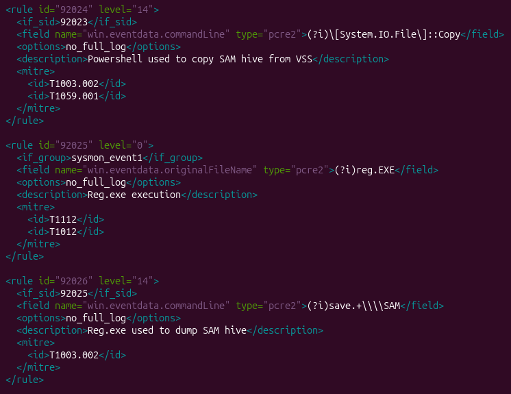](assets/poc/appendix-b-research/appendix-b-screenshot-27.png)

- These just look like an exploit chain at this point.

- **12-14 option**

[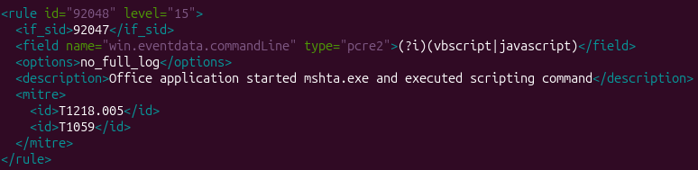](assets/poc/appendix-b-research/appendix-b-screenshot-28.png)

- Finally found a 15, but I don’t know what it means. I’ll have to research…

  - It requires 92047 first, which is “office application started mshta.exe”. Perfect example of a downstream detection rule.

  - **15+ option**

[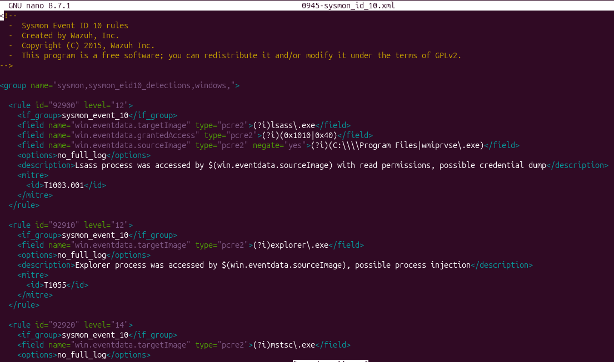](assets/poc/appendix-b-research/appendix-b-screenshot-29.png)

- Front page of Sysmon 10: Process Access

  - Note: This is also the only page. These are the only sysmon 10s it logs. Wow. **start from here**

10. 0840-win_event_channel.xml

11. 0915-win-powershell_rules.xml

12. 0999-malicious-ioc-rules.xml

After digging through a lot of these rulesets, I think a great mini project would just be a research project on Wazuh’s default ruleset. Just dive into each and create a little rule-alert chain. Not an exploit chain, but a rule-alert chain. I could dive into the possibilities of each. This is more of an educational project than anything, but it could be good proof of purchase.

- Editor’s note: This is basically what I ended up doing for the proof of concept, it made more sense as I put the project together.

Another note as I look into the Wazuh rulesets. You could learn about adversarial tactics by reverse-engineering the rulesets with relative ease. In fact, I think that’s what I’m inadvertently doing by studying them and thinking about their reason for being.

I’ve got a lot of really good starting points for this project. I don’t yet have a 16, but I have plenty of 0-7, 7-11, 12-14, and a 15 to choose from. I think that’s a good stopping point for now, although I’d love to keep looking into these rules sometime.

Now I choose the exact alerts I’d like to fire. Minimum is 4 of them right now, but I can mess with a few others if it seems necessarily. I’ll organize the GitHub succinctly per PoC exercise.

0-6 options:

- What this requires

  - Attacker SSH or RDP in, which means a few other logs will have already fired (login successful, rdp logon successful, see below for screenshots)

  - Opening of powershell from a different host (this likely won’t put much more than a level 0 Sysmon 1 in the event queue)

  - Depending on the operation, it may trigger different alerts

    - Easiest method is to try to open up administrator powershell but a local account that’s not the admin. That means I’ll need to create a new account as well, and that’s a different log…

  - Alternatively, I could just do this from the user account, try to view something that’s restricted.

    - Something like SeSecurityPrivilege (allows an account to view and manage audit and security event logs)

[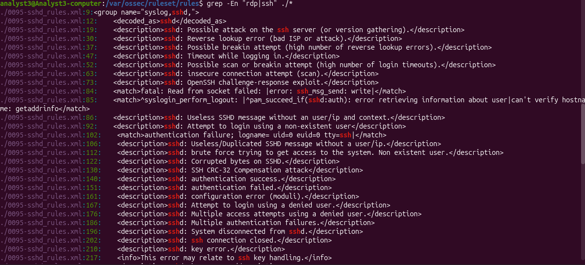](assets/poc/appendix-b-research/appendix-b-screenshot-31.png)

[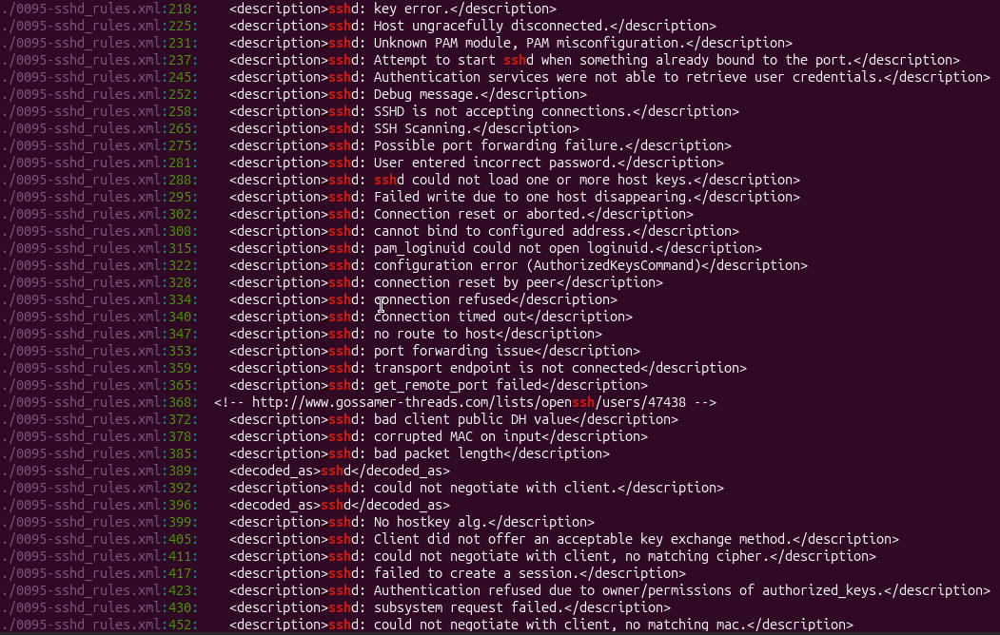](assets/poc/appendix-b-research/appendix-b-screenshot-32.png)

[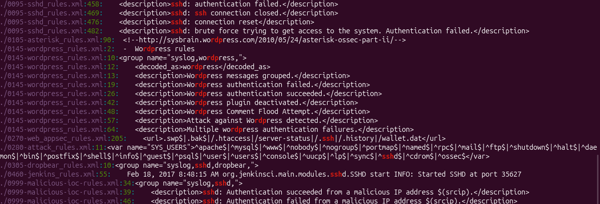](assets/poc/appendix-b-research/appendix-b-screenshot-33.png)

- Complete list of logs activated if I RDP/SSH in

  - Lines 281 458 469 482 39 46 are important to me

  - Note: there’s some wordpress ones in there. Those aren’t being counted.

  - Note 2: the login itself isn’t going to factor into much of anything, login success is going to be logged by windows as 4624 as per usual but nothing else, so I might have to actually look at the endpoint logs in the timeline if I want that information…

[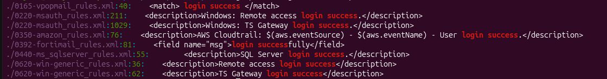](assets/poc/appendix-b-research/appendix-b-screenshot-34.png)

- Login success logs

  - Note: the only ones that matter to me are lines 36 and 62 from win-generic_rules.xml

[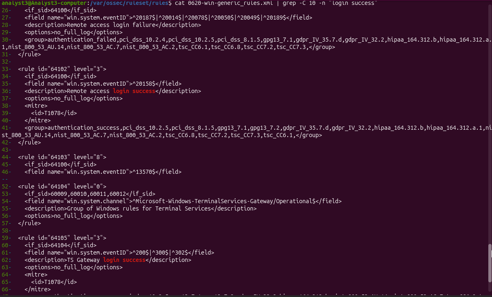](assets/poc/appendix-b-research/appendix-b-screenshot-35.png)

- Specs on login success logs

  - Remote access login failure = level 5 (out of screenshot)

  - Remote access login success = level 3

  - TS Gateway login success = level 3

    - Note: I think TS Gateway is a way to connect to a device using RDP over the internet w/o use of VPNs, so I don’t know that it applies here…

[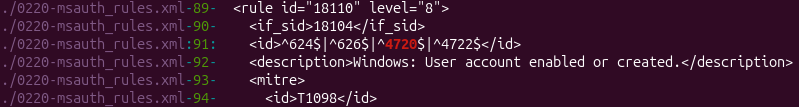](assets/poc/appendix-b-research/appendix-b-screenshot-36.png)

[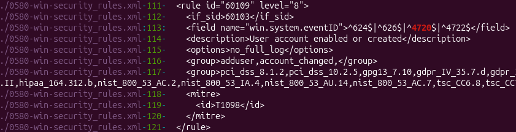](assets/poc/appendix-b-research/appendix-b-screenshot-37.png)

- User account creation is a level 8

  - Note that this exact entry appears in the win-security_rules.xml, so it may appear from two sources (or it may just appear from win-security_rules.xml)

Now the other option… is the same thing. It’s alright to have redundancy in research though, helps it stick…

- This could be the 7-11 and it’d just be the next step.

  - For a PoC, it’d be quite effective in showing varied severities. Could be a chain of events.

### Recap so far:

- 64101 Remote Access Login Failure (level = 5)

- 64109 Multiple Remote Access Login Failures (level = 10)

- 64102 Remote Access Login Success (level = 3)

- 60109 User account enabled or created (level = 8)

- 60107 Failed Attempt to perform a privileged operation (level = 4)

- 60154 Administrators Group Changed (level = 12)

  - Note: This entails WinEvent ID 4728/4732

    - 4728: a user or computer was successfully added to a security-enabled global group

    - 4732: indicates that a member was added to a security-enabled local group

### Continuing research…

[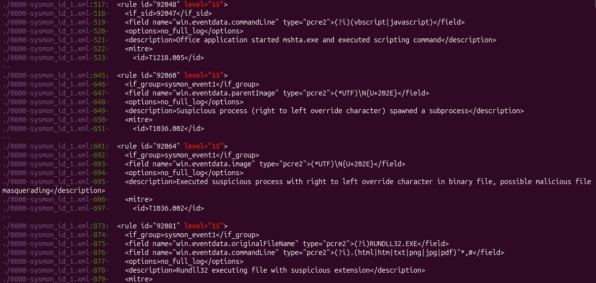](assets/poc/appendix-b-research/appendix-b-screenshot-39.png)

[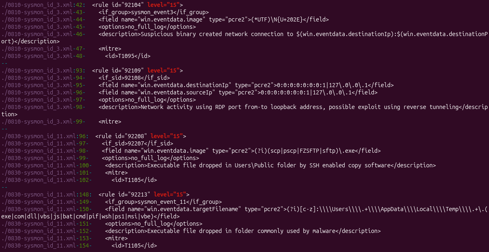](assets/poc/appendix-b-research/appendix-b-screenshot-40.png)

[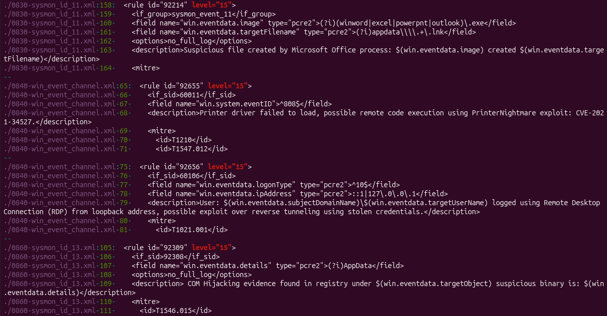](assets/poc/appendix-b-research/appendix-b-screenshot-41.png)

- I found more 15’s, not sure which I should go with for the PoC critical severity alert category…

Okay, I think I have enough ideas running around that I can get something tangible moving.

### PoC alert chain template \#1:

- 64101 Remote Access Login Failure (level = 5)

- 64109 Multiple Remote Access Login Failures (level = 10)

- 64102 Remote Access Login Success (level = 3)

- 60109 User account enabled or created (level = 8)

- 60107 Failed Attempt to perform a privileged operation (level = 4)

- 60154 Administrators Group Changed (level = 12)

  - Note: This entails WinEvent ID 4728/4732

    - 4728: a user or computer was successfully added to a security-enabled global group

    - 4732: indicates that a member was added to a security-enabled local group

- 92656 User: \$(win.eventdata.subjectDomainName)\\(win.eventdata.targetUserName) logged using Remote Desktop Connection (RDP) from loopback address, possible exploit over reverse tunneling using stolen credentials. (level = 15)

and/or

- 92109 Network activity using RDP port from-to loopback address, possible exploit using reverse tunneling (level = 15)

GPT re-work

[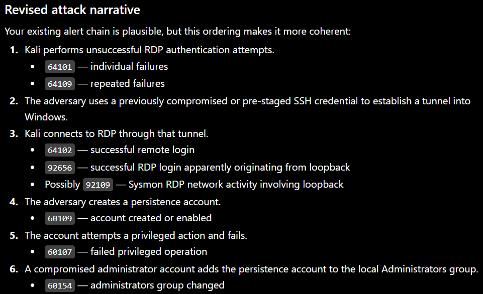](assets/poc/appendix-b-research/appendix-b-screenshot-42.png)

*End of research and planning*

- Editor’s note: I ended research at the gpt re-work because the rest of my notes went directly into the collections, i.e. the project was 98% human 2% AI, where AI served only to organize tables, fill knowledge gaps (briefly), and validate my logic (as seen here).
