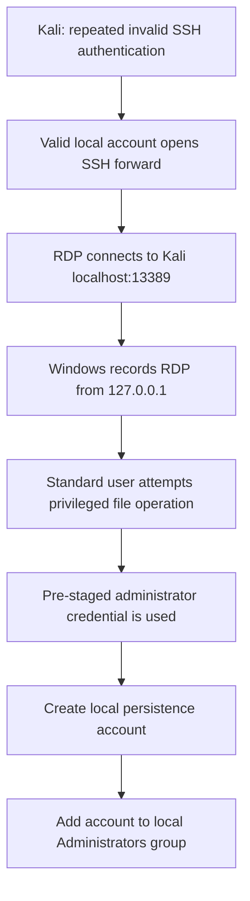
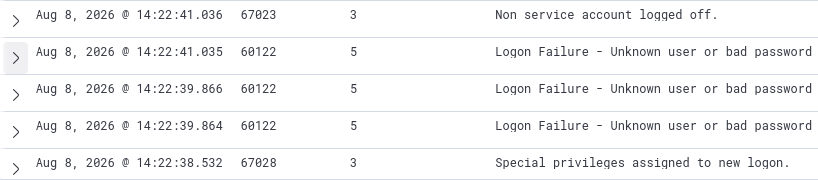
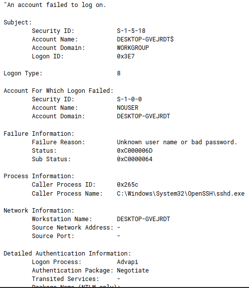
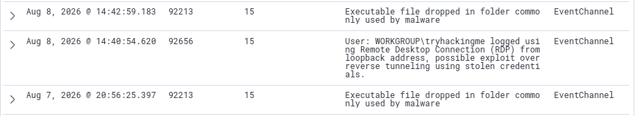
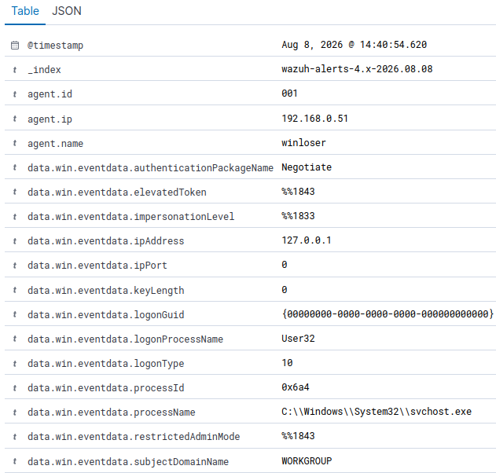
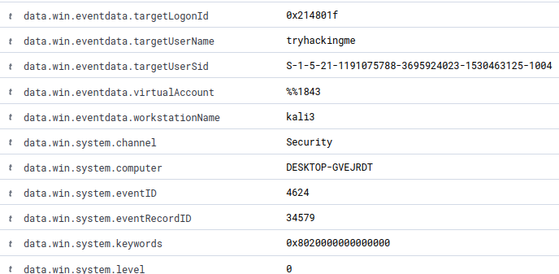
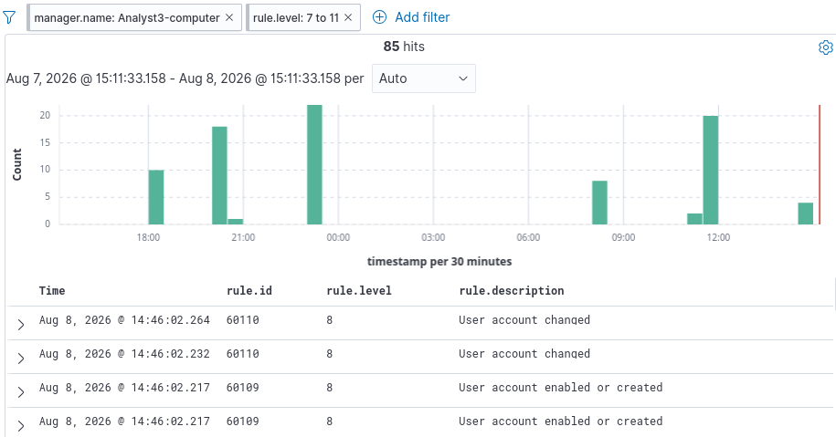
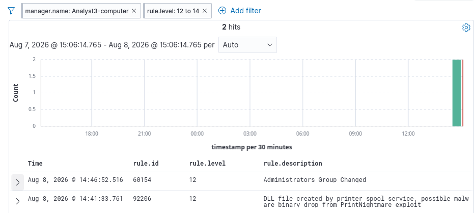
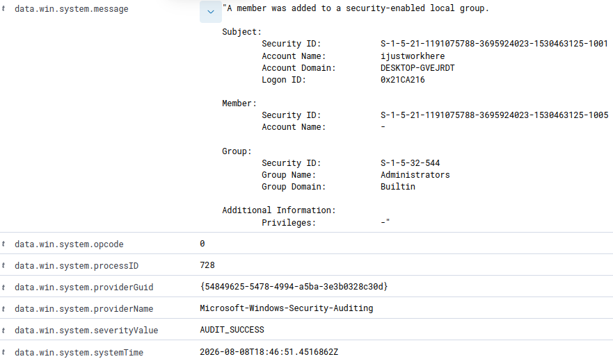
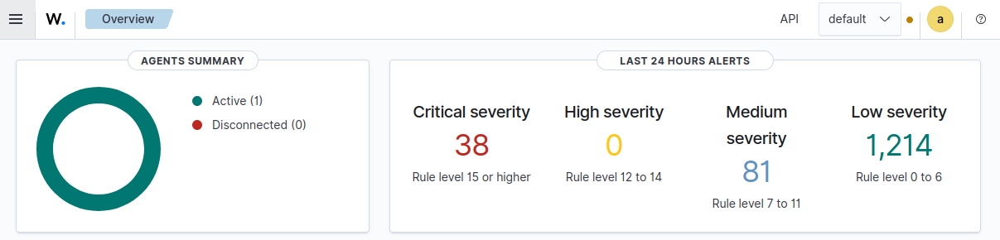

Heading:

# Proof of Concept

<a id="major-section-01"></a>

## The purposes of this exercise

The purpose of this is to demonstrate the primary purposes of the homelabv3.1 repository--monitoring and detection with a focus on (1) SOC Analyst skillsets, (2) pragmatic approaches to educational project planning, and (3) project execution from the perspective of the learner.

## Future Plans 

In the exercises and documentation to come, the focus will be depth of expertise in areas such as:

- triage/investigation

- incident response

- MITRE mapping

- TTP-exploration

- APT re-creation

For now, this Proof of Concept (PoC) simply serves as the baseline of presentation and workflow for the homelab. As such, an appropriately common yet narrow scope has been chosen for this PoC exercise.

## Document Directory

[Repository README](README.md) | [Infrastructure Baseline](Infrastructure-Baseline.md) | [Exercise PoC](Exercise-PoC.md) | [Appendix A: Collections](Appendix-a-collections.md) | [Appendix B: Research](Appendix-b-research.md)

### Major headings

- [The purposes of this exercise](#major-section-01)
- [Scope](#major-section-02)
- [Deviations from baseline (see: baseline-infrastructure)](#major-section-03)
- [Exercise Summary (tables)](#major-section-04)
- [Exercise Execution](#major-section-05)
- [MITRE ATT&CK Mapping](#major-section-06)
- [Incident Response Behaviors](#major-section-07)
- [Realworld scenario exploration](#major-section-08)
- [Results and lessons learned](#major-section-09)
- [Restoration](#major-section-10)

## Scope

On a practical level, the goal of the project is to execute a logical attack chain that includes all four areas of alerts that Wazuh qualifies:

- Low

- Medium

- High

- Critical

The rules I based the outline of this lab on are as follows

- 64101

- 5710

- 64109

- 5712

- 5715

- 64102

- 92656

- 60107

For detailed information, see Exercise Summary below.

For verbose information on these rules and the creation of this scope, see [PoC-appendix\[.\]md](Appendix-b-research.md), Research.

<a id="major-section-03"></a>

## Deviations from baseline (see: baseline-infrastructure)

For this exercise, I created a new local user account named “tryhackingme” that has misconfigured SSH and RDP access (see: “OWASP 02: security misconfigurations”)

<a id="major-section-04"></a>

## Exercise Summary (tables)

Hypothesized alert firings:

| **ID**    | **Level**   | **Source (in Rules)**  | **Description**                                                                                                                                                                                                             |
|-----------|-------------|------------------------|-----------------------------------------------------------------------------------------------------------------------------------------------------------------------------------------------------------------------------|
| **5710**  | 5 (low)     | sshd_rules.xml         | sshd: Attempt to login using non-existent user.                                                                                                                                                                             |
| **5712**  | 10 (medium) | sshd_rules.xml         | sshd: brute force trying to get access to the system. Non existent user.                                                                                                                                                    |
| **5715**  | 3 (low)     | sshd_rules.xml         | sshd: authentication success.                                                                                                                                                                                               |
| **60107** | 4 (low)     | win-security_rules.xml | Failed attempt to perform a privileged operation.                                                                                                                                                                           |
| **60109** | 8 (medium)  | win-security_rules.xml | User account enabled or created.                                                                                                                                                                                            |
| **60154** | 12 (high)   | win-security_rules.xml | Administrators Group Changed                                                                                                                                                                                                |
| **64101** | 5 (low)     | win-generic_rules.xml  | Remote access login failure                                                                                                                                                                                                 |
| **64102** | 3 (low)     | win-generic_rules.xml  | Remote access login success                                                                                                                                                                                                 |
| **64109** | 10 (medium) | win-generic_rules.xml  | Multiple remote access login failures                                                                                                                                                                                       |
| **92656** | 15          | win-event_channel.xml  | User: \$(win.eventdata.subjectDomainName)\\(win.eventdata.targetUserName) logged in remotely using Remote Desktop Connection (RDP) from loopback address, possible exploit over reverse tunneling using stolen credentials. |

Actual alerts found (matches marked with “!”):

| **ID**     | **Level**     | **Source (in rules)**  | **Description**                                                                                                                                                                                                             |
|------------|---------------|------------------------|-----------------------------------------------------------------------------------------------------------------------------------------------------------------------------------------------------------------------------|
| **60106**  | 3 (low)       | win-security_rules.xml | Windows Logon Success.                                                                                                                                                                                                      |
| **60109!** | 8 (medium)    | win-security_rules.xml | User account enabled or created.                                                                                                                                                                                            |
| **60110**  | 8 (medium)    | win-security_rules.xml | User account changed.                                                                                                                                                                                                       |
| **60118**  | 3 (low)       | win-security_rules.xml | Windows Workstation Logon Success                                                                                                                                                                                           |
| **60122**  | 5 (low)       | win-security_rules.xml | Logon Failure - Unknown user or bad password.                                                                                                                                                                               |
| **60154!** | 12 (high)     | win-security_rules.xml | Administrators Group Changed.                                                                                                                                                                                               |
| **60200**  | 3 (low)       | win-security_rules.xml | IIS NetworkClearText Logon                                                                                                                                                                                                  |
| **67023**  | 3 (low)       | WEF-baseline_rules.xml | Non service account logged off.                                                                                                                                                                                             |
| **67028**  | 3 (low)       | WEF-baseline_rules.xml | Special privileges assigned to new logon.                                                                                                                                                                                   |
| **92206**  | 12 (high)     | sysmon_id_11.xml       | DLL file created by printer spool service, possible malware binary drop from PrintNightmare exploit.                                                                                                                        |
| **92213**  | 15 (critical) | sysmon_id_11.xml       | Executable file dropped in folder commonly used by malware.                                                                                                                                                                 |
| **92656!** | 15 (critical) | win_event_channel.xml  | User: \$(win.eventdata.subjectDomainName)\\(win.eventdata.targetUserName) logged in remotely using Remote Desktop Connection (RDP) from loopback address, possible exploit over reverse tunneling using stolen credentials. |

<a id="major-section-05"></a>

## Exercise Execution

### Exercise Summary (writeup)

I simulated a brief, 7-step intrusion path from a Kali VM to a Windows 10 workstation with the presumption of certain rules firing based on my research into Wazuh rulesets (see appendix: research). Upon executing the Kali intrusion path, I attempted a succinct search using Rule ID’s from the researched ruleset, only to find that most rules were not fired, but the logic behind the rule existed elsewhere. This led to a fuller investigation, wherein I had to search for evidence of the adversary’s movements.

Specifically, the 7 step pathway used was:

1.  Repeated invalid SSH authentication to user account “tryhackingme” on Windows workstation

2.  Valid SSH authentication opening a listening tunnel via loopback address on port 13389

3.  RDP connects to Kali localhost:13389

4.  Attempted privileged process operation on compromised user account

5.  Pre-staged admin credential used for admin PowerShell

6.  Creation of persistence via account creation, “triedhackingyou”

7.  Privilege escalation via Admin Group admission of “triedhackingyou”

While the expected rules failed to fire, the goal of the exercise was achieved–trigger alerts in all four categories of Wazuh’s alert dashboard. Specifically:

| **Wazuh severity band** | **Confirmed representative alert**                          | **Level** |
|-------------------------|-------------------------------------------------------------|-----------|
| Low (0-6)               | 60122 - Logon Failure: unknown user or bad password         | 5         |
| Medium (7-11)           | 60109 - User account enabled or created                     | 8         |
| High (12-14)            | 60154 - Administrators Group Changed                        | 12        |
| Critical (15+)          | 92656 - RDP logon from loopback, possible reverse tunneling | 15        |

The primary analytical finding was a rule-pipeline mismatch. I hypothesized firings were based on sshd text logs and Microsoft Remote Access provider events, both of which run on decoding logic which was outside the scope of this project. Rather than sshd and Microsoft Remote Access provider events, OpenSSH and RDP-based records were generated through win_event_channel and win-security_rules. These misunderstandings demonstrate why analysts must understand processes first. While common tools and vendors should be understood at a baseline, understanding of process allows analysts to pivot when logs either (1) don’t appear as they expected or (2) fail to appear at all.

Skills demonstrated: Wazuh, Windows Event Logs, Sysmon, SIEM triage, SSH local port forwarding, RDP, alert correlation, rule analysis, MITRE ATT&CK mapping, false-positive disposition, evidence collection, and incident documentation.

#### Scope and Assumptions

This was a controlled validation exercise, not a complete compromise simulation.

- Enumeration of credentials and systems was pre-staged as those steps are outside the scope of the PoC exercise

- User account “tryhackingme” was created specifically to be compromised during this PoC exercise

- No malware, command-and-control payload, exfiltration, or destructive action was used.

- While “triedhackingyou” represents persistence, many areas of persistence such as scheduled task creation or any form of defense evasion/stealth were outside the scope of this PoC exercise

### Attack Path



The local forward was established with:

```bash
ssh -N -L 13389:127.0.0.1:3389 tryhackingme@192.168.0.51
```

Kali then connected FreeRDP to `127.0.0.1:13389`. SSH carried that traffic to Windows loopback port `3389`, causing the RDP logon event to identify `127.0.0.1` as its source while related telemetry retained the workstation name `kali3`.

#### Telemetry and Findings

Expected and observed detection

| **Planned rule** | **Planned meaning**                        | **Observed (y/n)** | **What the evidence showed**                                                                |
|------------------|--------------------------------------------|--------------------|---------------------------------------------------------------------------------------------|
| **64101**        | Remote access login failure                | No                 | Requires specific Microsoft Remote Access event IDs, not Security event 4625 from sshd.exe. |
| **5710**         | SSH login attempt using a nonexistent user | No                 | Requires a text record decoded as sshd; OpenSSH arrived through event channel.              |
| **64109**        | Multiple remote access login failures      | No                 | Correlates repeated 64101 matches, so the parent rule never became eligible.                |
| **5712 / 5720**  | Repeated SSH failures                      | No                 | Both depend on the sshd decoder branch and source-address correlation.                      |
| **5715**         | SSH authentication success                 | No                 | Requires an sshd success message, not Windows event 4624.                                   |
| **64102**        | Remote access login success                | No                 | Requires Remote Access event 20158; the observed record was Security event 4624.            |
| **92656**        | RDP logon from loopback                    | Yes                | Event 4624, Logon Type 10, and ipAddress: 127.0.0.1 satisfied the rule.                     |
| **60107**        | Failed privileged operation                | No                 | Requires Windows event 4673; no corresponding 4673 was found in the collected evidence.     |
| **60109**        | User account enabled or created            | Yes                | Account creation and enablement generated the required Security events.                     |
| **60154**        | Administrators group changed               | Yes                | Adding triedhackingyou to BUILTIN\\Administrators generated the group-change event.         |

This supports the idea that a good analyst doesn’t necessarily know 1000’s of detection rules–rather, they must understand detection logic. With only a few exceptions, the logic from the alert ID’s which failed to fire existed in other logs and was found during the investigation. With that, it’s time to move on to the timeline, evidence, interpretation and disposition of Kali’s adversarial activities.

### Timeline, evidence, interpretation, and disposition

| **Approximate time**          | **Wazuh rule** | **Level** | **Evidence and interpretation**                                                                                                                               | **Disposition**                                                       |
|-------------------------------|----------------|-----------|---------------------------------------------------------------------------------------------------------------------------------------------------------------|-----------------------------------------------------------------------|
| **14:22:38–14:22:41**         | 60122          | 5         | Event 4625; invalid accounts; ProcessName: ...\\OpenSSH\sshd.exe; Logon Type 8.                                                                               | True positive; password guessing                                      |
| **14:22–14:25**               | 67028, 67023   | 3         | Privileged session context/logoff surrounding new Windows authentication                                                                                      | Contextual telemetry; admin logoff around adversary logon.            |
| **14:24:55**                  | 60118, 60200   | 3         | Successful Windows logon records generated by sshd.exe; the 60200 IIS-oriented label was broader than the actual process (see appendix for IIS-oriented info) | True positive; valid-account access                                   |
| **14:40:53.451**              | 60106          | 3         | Event 4624, Logon Type 3, WorkstationName: kali3, ipAddress: 127.0.0.1.                                                                                       | Low-lying first evidence of compromise                                |
| **14:40:54.620**              | 92656          | 15        | Event 4624, Logon Type 10, user tryhackingme, process svchost.exe, source 127.0.0.1.                                                                          | True positive; tunneled RDP                                           |
| **14:41:33.761**              | 92206          | 12        | Printer-spooler DLL activity occurred during the RDP session without evidence connecting it to the attack steps.                                              | Benign/expected RDP printer activity; highly suspicious noise         |
| **14:42:59.183**              | 92213          | 15        | Executable or script created in a user Temp path. It appeared near the test but was not sufficient by itself to attribute malicious activity.                 | Benign PowerShell activity; highly suspicious noise                   |
| **14:46:02.217–14:46:02.264** | 60109, 60110   | 8         | Creation, enablement, and account-change records for new local user “triedhackingyou”.                                                                        | True positive - simulated persistence                                 |
| **14:46:52.516**              | 60154          | 12        | “triedhackingyou” was added to local group SID S-1-5-32-544 (Administrators).                                                                                 | True positive - simulated privilege escalation of persistence account |

### Key Evidence of Compromise

While the charts help to correlate information, they do not show it directly. A major component of a good analyst report is hard evidence, so here are four key areas which prove compromise from an analyst’s perspective.

1.  Failed SSH authentication was recorded as Windows logon failure

The failed attempts produced individual rule 60122 alerts rather than rules from the Linux-style sshd branch. Windows event 4625 identified sshd.exe as the caller but left the source network address blank, limiting same-source correlation.

<a id="screenshot-exercise-01"></a>

[](assets/poc/exercise/exercise-screenshot-01.png)

<a id="screenshot-exercise-02"></a>

[](assets/poc/exercise/exercise-screenshot-02.png)

This example alone does not prove compromise, however, there are 8 other examples of similar telemetry (i.e. noise surrounding a series of logon failures) which were enacted by Kali within 2 minutes. Following these failed logins is a successful login paired with the forced logoff of the admin logged in at the time. Note that NOUSER is input for “Account Name”, sshd.exe is under “Caller Process Name”, signifying a non-existent username was input during an SSH command. The surrounding failed logons have an almost identical description.

At the beginning of an investigation, this activity is highly suspicious, but by the evidence to come, it is proven to be malicious.

2.  The SSH forward carried RDP through Windows loopback

The SSH logon was definitely kali3, an unknown workstation, but upon RDP access, it appeared to be from 127.0.0.1. This isn’t automatically malicious, but it is highly suspicious. The initial logon looked like:

<a id="screenshot-exercise-03"></a>

[](assets/poc/exercise/exercise-screenshot-03.png)

<a id="screenshot-exercise-04"></a>

[](assets/poc/exercise/exercise-screenshot-04.png)

While important to the investigation, it proves very little on its own since admin often ssh into user accounts. The logon type being 8 defines that plaintext credentials were given (also shown by its predecessor log, “IIS NetworkClearText…”), which is a bit odd considering most admin function via some form of secure authentication manager, but it’s still possible that this is benign.

The malicious nature of this log is proven in its paired finding below.

<a id="screenshot-exercise-05"></a>

[](assets/poc/exercise/exercise-screenshot-05.png)

<a id="screenshot-exercise-06"></a>

[](assets/poc/exercise/exercise-screenshot-06.png)

<a id="screenshot-exercise-07"></a>

[](assets/poc/exercise/exercise-screenshot-07.png)

Note the noise, even within critical categories of alerts. Both level 15 alerts outside the PoC-desired rule id 92656 were found benign (evidence not shown; outside PoC scope).

The first two screenshots (SIEM discovery and log first glance) are highly suspicious. Specifically, a mix of the following:

data.win.eventdata.ipAddress = 127.0.0.1 (loopback)

\+

data.win.eventdata.logonType = 10 (remote interactive logon)

confirms the existence of a tunnel. Tunnels are *very* rarely used by sysadmins, where perhaps they wanted to bypass a custom security control to get into an account. Even in such instances, there’s likely a better way to go about this. Reading into the third screenshot (lower in the log) proves compromise.

data.win.eventdata.targetUserName = tryhackingme

\+

data.win.eventdata.workstationName = kali3

Kali3, at least in this scenario, is not the workstation that should have access to this user, and certain not via RDP in an SSH loopback tunnel.

3.  Account persistence and privilege assignment were detected

Creating local user “triedhackingyou” generated rules 60109 and 60110 for the related account lifecycle events.

<a id="screenshot-exercise-08"></a>

[](assets/poc/exercise/exercise-screenshot-08.png)

<a id="screenshot-exercise-09"></a>

[](assets/poc/exercise/exercise-screenshot-09.png)

Similar to the first example, a standalone log right these four rules does *not* indicate compromise. The golden ticket here is the aforementioned kali3 displayed as workstation name from the loopback RDP login. Given the timestamp of 14:40:54 in evidence 2 and the timestamp of 14:46:02 shown here, these events allow a logical timeline showing adversarial attempts at persistence after initial access via created accounts.

<a id="screenshot-exercise-10"></a>

[](assets/poc/exercise/exercise-screenshot-10.png)

<a id="screenshot-exercise-11"></a>

[](assets/poc/exercise/exercise-screenshot-11.png)

These two logs appearing next to each other display a potential compromise beyond the scope of my proof of concept.

Rule 92206 displays the symptoms of a much more damaging attack, but upon looking into the source and correlating it to the time, I realized my machine was in fact not compromsied (outside the controlled environment), and it was simply a system account performing routine maintenance. This may seem left field to add to my Proof of Concept documentation, but it is imperative that learners understand that noise discernment in Windows environments is a necessary skill.

Despite the false positive at 14:41:33, the administrators group change at 14:45:52–less than a minute after the “triedhackingyou” user account creation–displays privilege escalation of a persistence account.

The only sign of benign activity is that admin account “ijustworkhere” is the account that was used to enable this change, but SID …1001 (“ijustworkhere”) authorized SID …1005 (“triedhackingyou”) to join the local admin group. This is what it looks like when an admin PowerShell instance is opened with a user account, i.e. administrative action performed is shown to arise from the admin account which authorized it.

Note: In a true adversarial attempt, the account created should blend in, should require a password that only the attacker knows, and they would create a tighter foothold via C2, pre-staged online-hosted payloads, registry edits, scheduled tasks, etc. These actions were outside the scope of this proof of concept.

<a id="major-section-06"></a>

## MITRE ATT&CK Mapping

Beyond displaying evidence outright, it is important to correlate this evidence to adversarial frameworks. As it stands, MITRE appears to be the predominant framework in modern security practices, so it is the framework my projects will focus most on.

The MITRE ATT&CK mapping for this PoC exercise is as follows:

| **Exercise behavior**                    | **ATT&CK technique**                           | **Evidence strength**                                                                                                        |
|------------------------------------------|------------------------------------------------|------------------------------------------------------------------------------------------------------------------------------|
| Repeated invalid SSH credentials         | T1110.001 - Password Guessing                  | Strong; correlation of 60122 and 60106 logs prior to adversarial behavior                                                    |
| Use of pre-staged local credentials      | T1078.003 - Valid Accounts: Local Accounts     | Strong; correlation of 60106, 60109, 60110, and 60154 (given admin “ijustworkhere” in “Account Name” field for the latter 3) |
| Remote access over SSH                   | T1021.004 - Remote Services: SSH               | Certain; correlation of 60118, 60200, 92656 prior to persistence account creation and privilege escalation                   |
| RDP carried through an SSH local forward | T1572 - Protocol Tunneling and T1021.001 - RDP | Certain; observation of 92656 in context of prior alerts                                                                     |
| Creation of triedhackingyou              | T1136.001 - Create Account: Local Account      | Certain; observation of 60109 and 60110 after 92656                                                                          |
| Addition to local Administrators         | T1098.007 - Additional Local or Domain Groups  | Certain; observation of 60154                                                                                                |

#### Indicators of Compromise

Note that I am assuming this lab to be only part of a larger picture, framing this intrusion, persistence, and privilege escalation as confirmed malicious activity.

<table>
<colgroup>
<col style="width: 21%" />
<col style="width: 54%" />
<col style="width: 23%" />
</colgroup>
<thead>
<tr class="header">
<th><strong>Type</strong></th>
<th><strong>Indicator / Value</strong></th>
<th><strong>Analytical use</strong></th>
</tr>
<tr class="odd">
<th>Adversary hostname</th>
<th>kali3</th>
<th>Identifies the system associated with the tunneled RDP session. Correlate with the workstation field in the Type 3 logon preceding rule 92656.</th>
</tr>
<tr class="header">
<th>Target endpoint</th>
<th>DESKTOP-GVEJRDT / Wazuh agent winloser / 192.168.0.51</th>
<th>Defines the affected Windows asset and scopes authentication, account-management, Sysmon, and Wazuh searches.</th>
</tr>
<tr class="odd">
<th>Loopback address</th>
<th>127.0.0.1 in an RDP Logon Type 10 event</th>
<th>Indicates that RDP appeared to originate locally. When correlated with kali3 and the SSH tunnel, it supports protocol-tunneling activity.</th>
</tr>
<tr class="header">
<th>Failed-username pattern</th>
<th>Repeated account name NOUSER in win 4625 (wazuh 60122) prior to login success</th>
<th>Groups the repeated authentication failures into one password-guessing sequence rather than unrelated user mistakes.</th>
</tr>
<tr class="odd">
<th>Compromised-access account</th>
<th>tryhackingme<br />
SID: S-1-5-21-1191075788-3695924023-1530463125-1004</th>
<th>Tracks the standard local account used for successful SSH and RDP access following the failed attempts.</th>
</tr>
<tr class="header">
<th>Persistence account</th>
<th>triedhackingyou<br />
SID: S-1-5-21-1191075788-3695924023-1530463125-1005</th>
<th>High-value containment and hunting pivot. Search for its creation, enablement, logons, group memberships, and activity on this and other systems.</th>
</tr>
<tr class="odd">
<th>Administrator account</th>
<th>ijustworkhere<br />
SID: S-1-5-21-1191075788-3695924023-1530463125-1001</th>
<th>Identifies the privileged account responsible for creating and elevating triedhackingyou. In a real incident, determine how its credentials were obtained; here we assume pre-staged but provide no further info due to scope.</th>
</tr>
<tr class="header">
<th>Authentication process</th>
<th>C:\Windows\System32\OpenSSH\sshd.exe</th>
<th>Connects Events 4625 and 4624 to Windows OpenSSH. Legitimate by itself, but significant when correlated with repeated failures and subsequent tunneled access.</th>
</tr>
<tr class="odd">
<th>RDP logon process</th>
<th>C:\Windows\System32\svchost.exe with User32, Logon Type 10, and source 127.0.0.1</th>
<th>Supports identification of the RDP session that triggered rule 92656. The process is legitimate; the suspicious indicator is the complete field combination.</th>
</tr>
<tr class="header">
<th>Behavioral sequence</th>
<th>Repeated 4625 failures → successful 4624 SSH logon → Type 3/Type 10 loopback RDP → account creation/enablement → Administrators membership change</th>
<th>Strongest overall compromise indicator. Each event has possible benign explanations individually, but the ordered sequence substantially increases confidence of malicious activity.</th>
</tr>
</thead>
<tbody>
</tbody>
</table>

<a id="major-section-07"></a>

## Incident Response Behaviors

In a production environment, the sequence of repeated authentication failures, successful remote access + loopback-origin RDP, local account creation + admin group addition justifies immediate escalation. In most environments, this would also warrant a level of containment.

Recommended actions would include:

- Isolate the endpoint or restrict its remote-access paths

- Disable “triedhackingyou”, remove unauthorized group memberships, and terminate related sessions

- Reset credentials for affected local accounts and determine how they were obtained.

- Review events 4624, 4625, 4672, 4720, 4722, 4732, and related Sysmon records by Logon ID, Process ID, account, and timestamp.

- Search other endpoints for the account names, hostname “kali3”, loopback RDP patterns, and matching file-creation events

- Validate 99213 and 99206 artifacts in your environment before classifying them as malicious or benign.

<a id="major-section-08"></a>

## Realworld scenario exploration

This PoC’s primary purpose is to prove the concept of this homelab and its projects as effective vessels for growth as a security practitioner. As such, I find it necessary to include a section on realworld practices. While this exercise was a simulation, it includes common tactics and scenarios. Here is a brief exploration of what these alerts could imply in both false positive and true positive scenarios.

| **Alert**                                                                                 | **Potential false positive explanation**                                   | **Potential true positive explanation**                 | **Primary pivots**                                                                                                                        |
|-------------------------------------------------------------------------------------------|----------------------------------------------------------------------------|---------------------------------------------------------|-------------------------------------------------------------------------------------------------------------------------------------------|
| 60122 - Logon Failure - Unknown user or bad password                                      | User mistyped a password or a service retained stale credentials           | Password guessing/credential stuffing                   | Account count, failure rate, source address, process, successful follow-on logon                                                          |
| 60118 - windows workstation logon success                                                 | Approved remote support through Windows OpenSSH                            | Valid-account remote access after credential compromise | ProcessName, user, source, time, prior failures, authorized-access records                                                                |
| 60106 - Windows Logon Success + 92656 - RDP loopback ..                                   | Approved local proxy, support tool, or administrator-created tunnel (rare) | RDP concealed inside an SSH tunnel                      | Logon Types 3 and 10, workstation, listener, SSH process/session, account                                                                 |
| 67028 - Special privileges assigned to new logon + 67023 - non service account logged off | Normal Windows service or logon-session lifecycle                          | Privileged access followed by rapid session termination | Subject SID, privileges, Logon ID, related authentication and process events                                                              |
| 60109 - User account enabled or created + 60110 - User account changed                    | Normal onboarding or local service-account maintenance                     | Adversary-created persistence account                   | Track target SID, change ticket, naming convention, immediate follow-on actions                                                           |
| 60154 - Administrators Group Changed.                                                     | Authorized IT group-membership change                                      | Persistence account granted administrative privileges   | Track Logon ID, target SID, approval record, preceding account-creation events, scheduled-tasks, permissions edits, file/process creation |
| 92213 - Executable file dropped in folder commonly used by malware.                       | PowerShell policy test, installer, updater, or browser unpacking in Temp   | Payload staging or malware drop                         | Target path, creator process, parent, hash/signature, execution and network activity, cross-reference operations baseline                 |
| 92206 - DLL file created by printer spool service                                         | Printer installation/update or RDP printer redirection                     | PrintNightmare-related DLL placement                    | DLL path/hash, spooler process, print activity, remote source, CVE-specific behavior                                                      |

<a id="major-section-09"></a>

## Results and lessons learned

As stated through, the objective of this is PoC to prove that the baseline infrastructure can support repeatable monitoring and detection exercises. Specifically, this PoC explored the four severities of alert that Wazuh provides in its dashboard through a carefully curated intrusion sequence from Kali into a Windows 10 endpoint with exposed SSH and RDP.

While the curation was done to ensure the project’s focus lie in the homelab’s proof of purchase and focus on documentation of events, the scope was widened by the lessons learned. With that, here’s a summation of improvements to make in my project planning and hypotheses moving forward:

1.  If I base an investigation on SIEM rule id’s, I must validate the complete rule chain before execution. This includes decoder, parent rule, provider, event ID, correlation key, frequency, and timeframe.

2.  Windows noise often looks incredibly malicious, such as the numerous level 15 alerts stating potential malicious file-drop that appeared as I set up the lab and executed it. Future labs may want to include explicit assumptions on noise baselines and/or edits to rule firing logic to enable cleaner demonstrations.

3.  Export structured event data in addition to screenshots so future timelines can be normalized, filtered, and independently verified; I spent a lot of time offscreen extracting filtered data from screenshots with AI and manually verifying it.

For result context, the dashboard changed from 38 to 41 critical, 0 to 2 high, 81 to 85 medium, and 1,214 to 1,305 low alerts during the collection window. Perhaps one of the most important lessons reinforced was just how noisy Windows environments often are.

As an analyst, looking at a dashboard with 1,329 alerts looks nearly the same as one with 1,431 alerts. Events such as scheduled updates, boot-ups, shutdowns, and environment prep/edits created more logs than the actual exercise during the 24-hour window that alerts are displayed in Wazuh. It may also be noted that 40 of the 41 critical alerts were benign (this was investigated outside the scope of this PoC).

<a id="screenshot-exercise-12"></a>

[](assets/poc/exercise/exercise-screenshot-12.png)

- before

<a id="screenshot-exercise-13"></a>

[](assets/poc/exercise/exercise-screenshot-13.png)

- After

<a id="major-section-10"></a>

## Restoration

While this exercise permits itself to the start of a much larger exploit chain and series of projects, I have chosen to scope new projects for such purposes, thereby, the baseline found in  [Infrastructure Baseline](Infrastructure-Baseline.md) will be restored.

# Further documentation

For further documentation of Wazuh findings and attempted rule firings, the Kali perspective, and my Wazuh rule id research which fueled the scope of this project, see [PoC-Appendix](Appendix-a-collections.md) and [Appendix B: Research](Appendix-b-research.md) respectively. 
