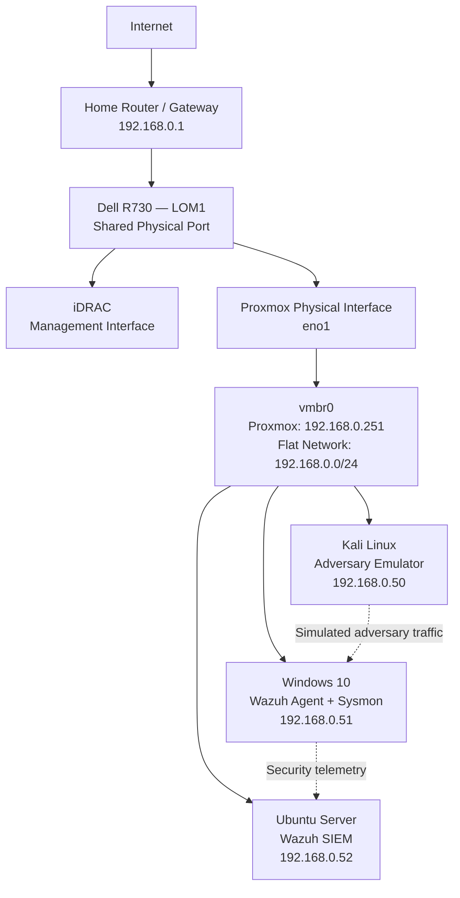

# What is this document 

This document serves to explain my baseline infrastructure, as I plan to change things as is necessary per project. 

## Network Topography 

## Environment Specifications

### Physical Host

| Component             | Baseline Configuration                                |
| --------------------- | ----------------------------------------------------- |
| Server                | Dell PowerEdge R730, 8-bay                            |
| Hypervisor            | Proxmox VE 8.1.3                                      |
| Hypervisor Kernel     | Linux 6.5.11-4-pve                                    |
| Processor             | 2 × Intel Xeon E5-2667 v4 @ 3.20 GHz                  |
| Compute Capacity      | 16 physical cores / 32 logical threads                |
| Memory                | 64 GB RAM                                             |
| Boot Storage          | 1 × 80 GB SSD containing Proxmox VE                   |
| VM Storage            | 3 × 1.2 TB SAS HDD                                    |
| Storage Configuration | ZFS pool named `tank1`                                |
| RAID Configuration    | Hardware RAID disabled; disks exposed directly to ZFS |
| Physical Interface    | `eno1`                                                |
| Proxmox Bridge        | `vmbr0`                                               |
| Remote Management     | Dell iDRAC using Shared LOM on LOM1                   |
| iDRAC Address         | `192.168.0.250`                                       |
| Proxmox Address       | `192.168.0.251`                                       |

### Virtual Machines

| System           | Purpose                                     | Operating System                                     | vCPU |   RAM | Storage | Static IP      | Principal Software                                              |
| ---------------- | ------------------------------------------- | ---------------------------------------------------- | ---: | ----: | ------: | -------------- | --------------------------------------------------------------- |
| Kali Adversary   | Attacker             | Kali Linux 2026.2 Rolling, kernel 6.19.14+kali-amd64 |    4 |  8 GB |   80 GB | `192.168.0.50` | Kali security toolset                                           |
| Windows Endpoint | Victim                | Windows 10 Pro 22H2, x64, build 19045                |    4 |  8 GB |  100 GB | `192.168.0.51` | Wazuh Agent 4.14.6-1, Sysmon with SwiftOnSecurity configuration |
| Wazuh Server     | Security Analyst | Ubuntu 26.04 LTS                                     |    4 | 12 GB |  120 GB | `192.168.0.52` | Wazuh all-in-one 4.14.6-1                                       |

### Network and Management

| Component            | Baseline Configuration                                     |
| -------------------- | ---------------------------------------------------------- |
| Network Architecture | Flat, bridged lab network                                  |
| Subnet               | `192.168.0.0/24`                                           |
| Default Gateway      | `192.168.0.1`                                              |
| Addressing           | Static IP addresses assigned to Proxmox, iDRAC and all VMs |
| Internet Connection  | Home router connected through physical LOM1                |
| Virtual Networking   | All VMs bridged through `vmbr0` using `eno1`               |
| Network Segmentation | None                         |
| Remote Access        | Enabled via VPN Tunneling                                             |
| Guest Integration    | QEMU Guest Agent installed and active on all VMs           |

### Security Monitoring Baseline

| Control or Service           | Baseline State                                                             |
| ---------------------------- | -------------------------------------------------------------------------- |
| Wazuh Deployment             | Single-node, all-in-one manager, indexer and dashboard                     |
| Endpoint Telemetry           | Windows endpoint reporting to the Wazuh server                             |
| Sysmon Collection            | `Microsoft-Windows-Sysmon/Operational` collected by the Windows endpoint Wazuh agent        |
| Sysmon Configuration         | SwiftOnSecurity baseline configuration                                     |
| Windows Remote Access        | RDP and SSH enabled                                                        |
| Windows Firewall             | Explicit rules permitting SSH and Wazuh communications                     |
| Windows Time Synchronization | W32Time configured to use `pool.ntp.org`                                   |
| Virtual Clock Handling       | Windows configured to interpret the Proxmox-provided hardware clock as UTC |
| Display Timezone             | Eastern Time                                                               |
| Windows Membership           | Standalone workstation in the default `WORKGROUP`                          |

### Recovery and Exercise Reset Strategy

| Element                | Implementation                                                                                                                         |
| ---------------------- | -------------------------------------------------------------------------------------------------------------------------------------- |
| Recovery Purpose       | Return the environment to a known good baseline after exercise-specific changes                                                        |
| Planned Recovery Point | Coordinated offline Proxmox snapshots of the Kali, Windows and Wazuh VMs                                                               |
| Snapshot Naming        | Shared naming format: `baseline_YYYY-MM-DD`                                                                                      |
| Snapshot Storage       | ZFS copy-on-write snapshots stored in `tank1`                                                                                          |
| Evidence Retention     | Export alerts, screenshots, timelines and investigation notes before rollback                                                          |
| Limitation             | VM snapshots provide rapid state restoration but are not independent backups                                                           |

## Baseline Change Control

Changes exist on a per-project basis and will be documented explicitly as an intentional departure from this baseline. The changelog template is as follows:

| Component               | Baseline State           | Exercise Modification | Effect on Attack Surface                | Restoration Status    |
| ----------------------- | ------------------------ | --------------------- | --------------------------------------- | --------------------- |
| *Document per exercise* | *Original configuration* | *Intentional change*  | *Resulting exposure or security impact* | *Restored / Retained* |

An example of this changelog in action would look like: 

| Component        | Baseline State                         | Exercise Modification                  | Effect on Attack Surface                                     | Restoration Status |
| ---------------- | -------------------------------------- | -------------------------------------- | ------------------------------------------------------------ | ------------------ |
| Windows Firewall | SSH access limited to approved systems | Permitted SSH traffic from the Kali VM | Enabled password-based attacks from the simulated adversary  | Restored           |
| User Account     | Strong password configured             | Assigned a deliberately weak password  | Increased susceptibility to credential attacks               | Restored           |
| Remote Desktop   | RDP access restricted                  | Permitted RDP traffic from the Kali VM | Exposed remote authentication to simulated adversary traffic | Restored           |
