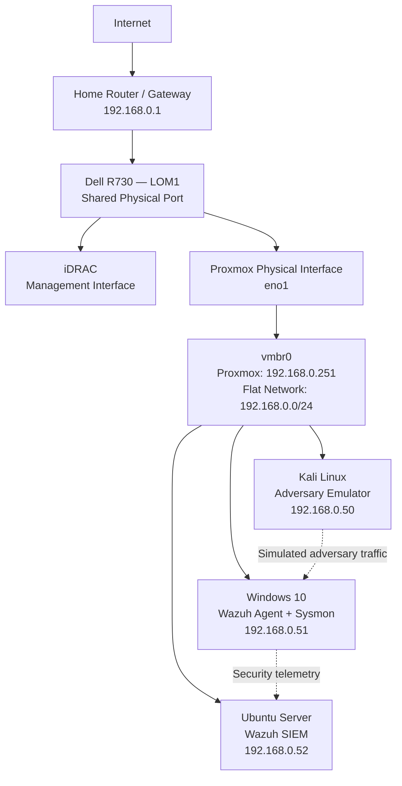

# What is this document 

This document serves to explain my baseline infrastructure, as I plan to change things as is necessary per project. 

## Network Topography 

```mermaid
flowchart TB
    Internet["Internet"] --> Router["Home Router / Gateway<br/>192.168.0.1"]
    Router --> LOM1["Dell R730 — LOM1<br/>Shared Physical Port"]

    LOM1 --> iDRAC["iDRAC<br/>Management Interface"]
    LOM1 --> eno1["Proxmox Physical Interface<br/>eno1"]
    eno1 --> Bridge["vmbr0<br/>Proxmox: 192.168.0.251<br/>Flat Network: 192.168.0.0/24"]

    Bridge --> Kali["Kali Linux<br/>Adversary Emulator<br/>192.168.0.50"]
    Bridge --> Windows["Windows 10<br/>Wazuh Agent + Sysmon<br/>192.168.0.51"]
    Bridge --> Wazuh["Ubuntu Server<br/>Wazuh SIEM<br/>192.168.0.52"]

    Kali -. "Simulated adversary traffic" .-> Windows
    Windows -. "Security telemetry" .-> Wazuh
```

